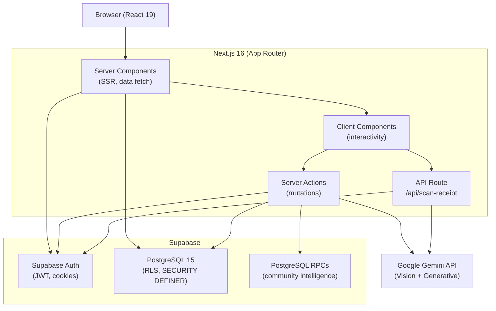
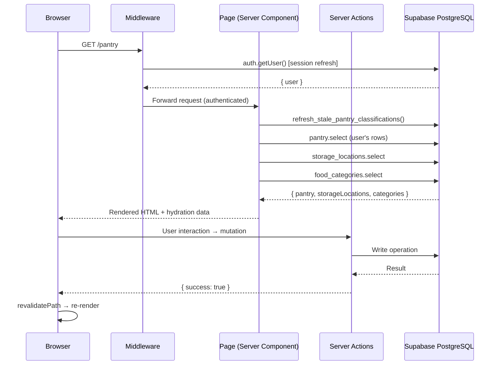
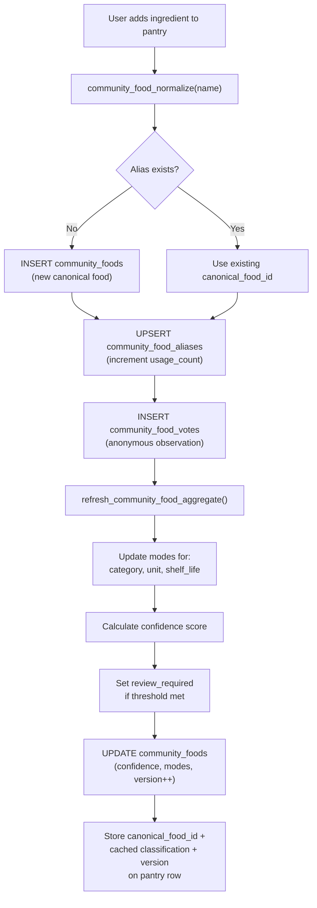
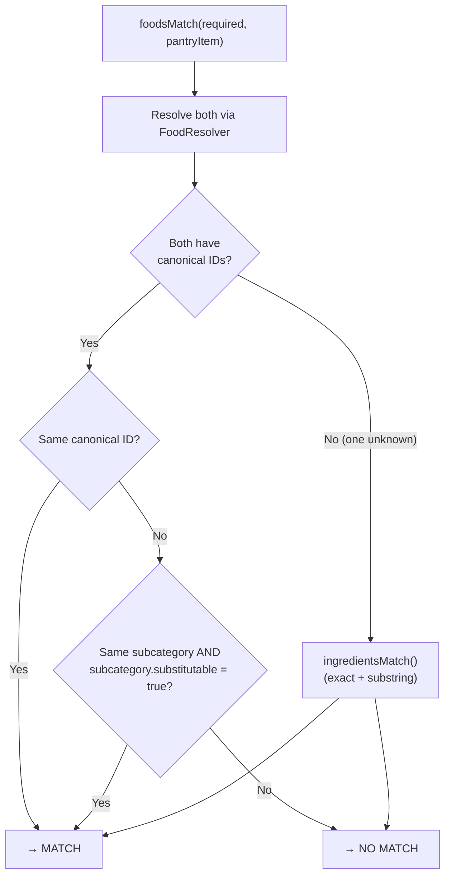
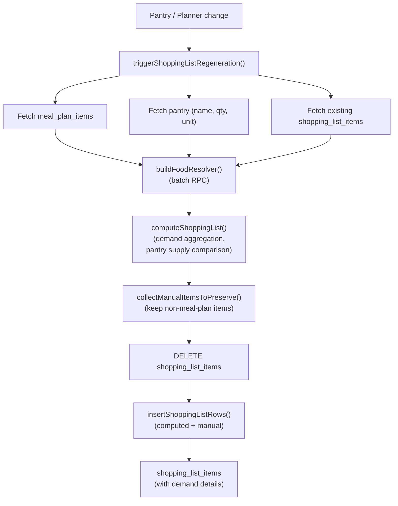
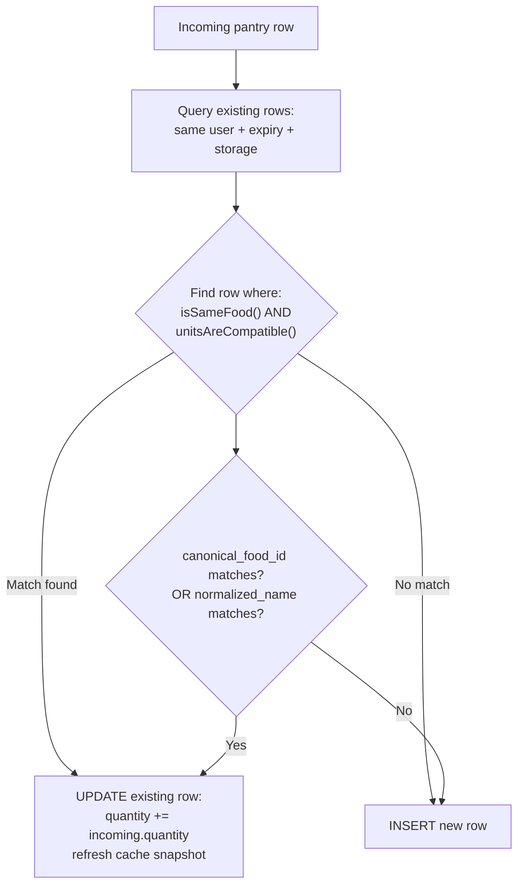
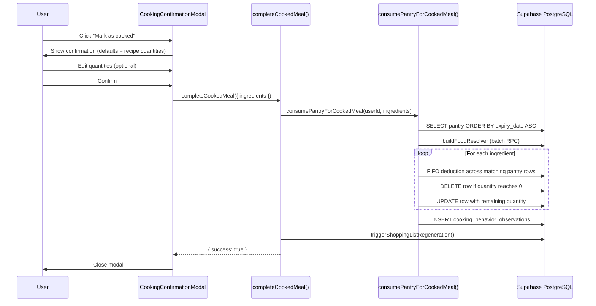
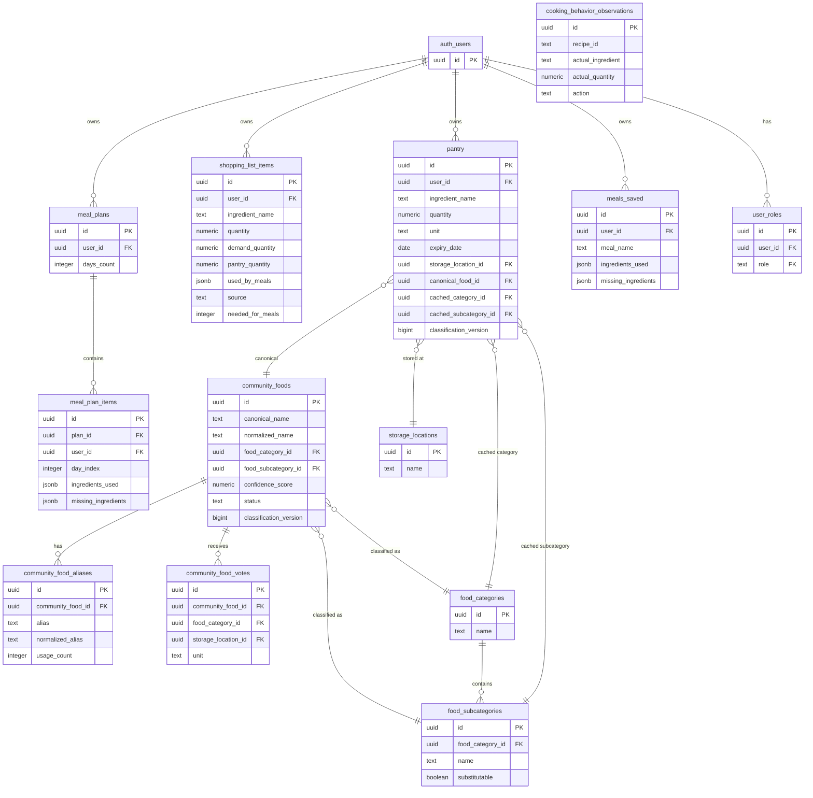

# ShelfLife v2 — Software Architecture & Engineering Documentation

**Classification:** Internal Engineering Reference  
**Version:** 2.0  
**Status:** Current  
**Last Updated:** July 2026  
**Target Audience:** Future engineers, technical due diligence, platform team, AI assistants

---

## Table of Contents

1. [Executive Summary](#1-executive-summary)
2. [System Architecture](#2-system-architecture)
3. [Technology Stack](#3-technology-stack)
4. [Folder Structure](#4-folder-structure)
5. [Database Architecture](#5-database-architecture)
6. [Authentication](#6-authentication)
7. [Community Food Intelligence](#7-community-food-intelligence)
8. [Pantry Engine](#8-pantry-engine)
9. [Shopping Engine](#9-shopping-engine)
10. [Recipe Engine](#10-recipe-engine)
11. [Meal Planner](#11-meal-planner)
12. [Receipt Scanner](#12-receipt-scanner)
13. [Cooking Engine](#13-cooking-engine)
14. [Semantic Matching Engine](#14-semantic-matching-engine)
15. [Platform Administration](#15-platform-administration)
16. [Shared Components](#16-shared-components)
17. [API & Server Actions](#17-api--server-actions)
18. [Testing](#18-testing)
19. [Deployment](#19-deployment)
20. [Security](#20-security)
21. [Performance](#21-performance)
22. [Technical Debt](#22-technical-debt)
23. [Roadmap](#23-roadmap)
24. [Version History](#24-version-history)
25. [Appendix — Architecture Diagrams](#25-appendix--architecture-diagrams)

---

## 1. Executive Summary

### Vision

ShelfLife is a household food management platform. Its primary purpose is to eliminate food waste and reduce shopping friction by maintaining a living model of the user's pantry, matching that pantry against a built-in recipe catalogue, generating AI-assisted meal suggestions and plans, and producing a shopping list derived from the gap between pantry supply and meal demand.

The platform distinguishes itself through a **Community Food Intelligence** layer — a privacy-preserving crowd-sourced knowledge graph that learns canonical food identities, normalised names, aliases, classification taxonomy, shelf-life defaults, and storage preferences from aggregated anonymous user behaviour. This graph powers semantic recipe matching, meaning that a user with "Macaroni" in their pantry will correctly satisfy a recipe requiring "Pasta," while "Onion" will never satisfy "Garlic."

### Maturity and Scale

ShelfLife v2.0 is a production-ready, commercially deployable application built on proven open-source infrastructure. It is not a prototype. The architecture reflects a deliberate series of refactors — removing technical debt, consolidating duplicated logic, introducing canonical engines for all major business operations, and building a foundation that scales without redesign.

The codebase contains:

- 21 application routes (pages, APIs, auth callbacks)
- 10 server action files (~18 exported async functions)
- 1 REST API route (`/api/scan-receipt`)
- 14 Supabase database migrations
- 14 core business logic libraries in `src/lib/`
- 100 built-in recipes in the static catalogue
- 17 food taxonomy categories, 29 starter subcategories, 6 storage location types
- A starter knowledge graph seeding 17 verified canonical food entries (Pasta and Cheese families)
- A Node.js test suite with 17 regression tests

### Current Limitations

- The recipe catalogue is static (TypeScript data file). Dynamic community recipes are not yet implemented.
- Saved meals store a snapshot of `ingredientsUsed` / `missingIngredients` at save time, not a live recipe reference. Pantry re-match does not occur on the Saved Meals page.
- Unit conversion (e.g. `g` → `kg`, `ml` → `l`) is partially implemented with unit normalisation but no scale conversion.
- There is one Supabase project for development and one for production; the development project is linked in the repository's Supabase temp files.
- No automated deployment pipeline exists beyond Next.js/Vercel build checks. There is no CI runner.
- Migration history alone is not sufficient evidence that Development and Production have the same schema (see [19.6 Production Schema Reconciliation](#196-production-schema-reconciliation-july-2026)). A forensic schema comparison is now part of every release process, not just a check of `supabase_migrations.schema_migrations`.

---

## 2. System Architecture

### 2.1 High-Level Architecture

```
Browser
  └── Next.js 16 (App Router, React 19)
        ├── Server Components (SSR, data fetching)
        ├── Client Components (interactivity, state)
        ├── Server Actions (mutations, AI calls)
        └── API Route /api/scan-receipt (Gemini Vision)

Backend Services
  └── Supabase
        ├── PostgreSQL 15 (primary data store)
        │     ├── Row-Level Security (per-user isolation)
        │     ├── SECURITY DEFINER functions (community intelligence)
        │     └── Triggers (classification version bumping)
        ├── Supabase Auth (JWT-based, email/password)
        └── Supabase SSR (@supabase/ssr, cookie-based sessions)

External AI
  └── Google Gemini API
        ├── Vision model — receipt OCR and ingredient extraction
        └── Generative model — AI meal suggestions and meal plan generation
```

### 2.2 Request Architecture

Every page in ShelfLife follows a consistent pattern:

1. **Middleware** (`src/middleware.ts` → `src/lib/supabase/middleware.ts`) runs on every non-static request. It calls `supabase.auth.getUser()`, refreshes the session, and enforces route-level access control before the page renders.
2. **Server Component page** (`app/[route]/page.tsx`) is an `async` function. It creates a Supabase server client, fetches all required data in parallel, and passes typed props to child components.
3. **Client Components** receive data as props. They hold ephemeral UI state (`useState`, `useEffect`), handle user interactions, and call **Server Actions** for mutations.
4. **Server Actions** (`app/actions/*.ts`) are tagged `"use server"`. They re-authenticate the user via `supabase.auth.getUser()`, perform business logic and database mutations, call `revalidatePath()` to invalidate Next.js caches, and return typed result objects to the client.
5. **Client Components** react to server action results by updating local state or displaying errors/success messages.

No direct Supabase calls from Client Components occur. All Supabase interactions go through Server Components or Server Actions.

### 2.3 Server Actions Pattern

Server Actions are the primary mutation and side-effect layer. All of them follow a consistent contract:

```typescript
// Every server action authenticates first
async function getAuthenticatedUser() {
  const supabase = await createClient();
  const { data: { user } } = await supabase.auth.getUser();
  if (!user) { redirect("/login"); }
  return { supabase, user };
}

// Server actions return typed discriminated unions
type Result =
  | { success: true }
  | { success: false; error: string };
```

Mutations always call `revalidatePath()` for all affected routes so that stale SSR cache is cleared and subsequent page loads reflect the change.

### 2.4 Data Flow — Shopping List Generation (Example)

```
Pantry add (user action)
  → addIngredient server action
  → learnAndSnapshot (community observation, silent failure safe)
  → insertOrStackPantryItem (canonical pantry engine)
  → triggerShoppingListRegeneration
      → regenerateShoppingList
          → fetchActivePlanItems (meal_plans + meal_plan_items)
          → pantry.select (ingredient_name, quantity, unit)
          → buildFoodResolver (resolve_community_foods RPC + substitutable subcategories)
          → computeShoppingList (demand aggregation, pantry supply comparison)
          → shopping_list_items.delete (all user rows)
          → insertShoppingListRows (shared persistence helper)
  → revalidatePath("/shopping")
  → revalidatePath("/dashboard")
```

### 2.5 State Management

ShelfLife does not use a global client-side state management library (no Redux, Zustand, Jotai, etc.). State management follows Next.js conventions:

| State Type | Mechanism |
|---|---|
| Server data | Server Component fetch → props → client state seed |
| Ephemeral UI state | `useState` / `useRef` in Client Components |
| Form state | `useActionState` for progressive enhancement forms |
| Route-level data invalidation | `revalidatePath()` in Server Actions |
| Authentication state | Supabase session via cookie, read in middleware |
| Receipt drag context | React context (`ReceiptDropContext`) |

### 2.6 Caching Strategy

- **Next.js route caches** are invalidated by `revalidatePath()` calls in Server Actions. The application does not configure segment-level cache durations.
- **Pantry classification cache**: each pantry row stores a `cached_category_id`, `cached_subcategory_id`, and `classification_version` snapshot. The `refresh_stale_pantry_classifications()` PostgreSQL function self-heals stale snapshots based on monotonic version comparison. This avoids a live join to `community_foods` on every pantry render.
- **Food resolver**: built on the server per page/action request using `buildFoodResolver()`. It is a plain serialisable object that can be passed from Server Components down to Client Components without hydration issues.
- **Static recipe catalogue**: loaded from a TypeScript import at build time. 100 recipes. No database round-trip required for recipe data reads.

---

## 3. Technology Stack

### 3.1 Core Framework

**Next.js 16.2.10** (App Router)  
*Why:* App Router provides server-first rendering with React Server Components, enabling data fetching at the page level without an intermediate API layer. Server Actions eliminate the need for `pages/api/` routes for mutations. Turbopack provides fast local development.

**React 19.2.4**  
*Why:* Required by Next.js 16. React 19 introduces stable Server Components, streaming SSR, and the `useActionState` hook that ShelfLife uses for form state management.

**TypeScript 5**  
*Why:* Strict mode (`"strict": true` in `tsconfig.json`). TypeScript provides compile-time safety across 100+ source files and prevents an entire class of runtime errors.

### 3.2 Backend as a Service

**Supabase (`@supabase/supabase-js` 2.110.2, `@supabase/ssr` 0.12.0)**  
*Why:* Supabase provides PostgreSQL with built-in Row-Level Security, Auth with JWT tokens, and a client library specifically designed for SSR applications. `@supabase/ssr` handles cookie-based session management in Next.js middleware without requiring custom token refresh logic.

Supabase is used for:
- User authentication (registration, login, password reset)
- All relational data (pantry, shopping list, meal plans, community intelligence)
- SECURITY DEFINER PostgreSQL functions that enforce server-side business rules
- Row-Level Security policies that ensure per-user data isolation at the database level

### 3.3 AI

**Google Generative AI (`@google/generative-ai` 0.24.1)**  
*Why:* Gemini provides both vision capabilities (receipt OCR) and generative text capabilities (meal suggestions, AI meal plan generation) in a single SDK. The Gemini API is the only external AI provider.

Used in two distinct modes:
1. **Vision mode** (`/api/scan-receipt`): A multimodal call with a base64-encoded receipt image and a structured extraction prompt. Returns JSON ingredient lists.
2. **Generative mode** (`getCatalogueMealSuggestions`, `suggestMeals`, `generateMealPlan`): Text-only generative calls with structured prompts, receiving JSON responses that are parsed by typed parser functions.

Gemini calls are wrapped in `withGeminiRetry()` which implements exponential backoff with jitter for rate-limit errors (`429`) and transient failures (`503`).

### 3.4 Styling

**Tailwind CSS 4** with **`@tailwindcss/postcss` 4**  
*Why:* Utility-first CSS eliminates context switching between CSS files and component logic. Tailwind v4 introduces a CSS-first configuration approach.

The design system is built on CSS custom properties defined in `src/styles/tokens.css` and `src/styles/theme.css`, applied through a structured set of utility classes in `src/styles/base.css`. The design system exports canonical class-name helpers via `src/lib/design-system.ts`.

### 3.5 Icons

**Lucide React 1.24.0**  
*Why:* Consistent, tree-shakeable SVG icon set. Every icon import is explicitly named.

### 3.6 Testing

**Node.js built-in test runner** (`node --test`)  
*Why:* No test runner dependency. The Node.js built-in runner supports `async` tests, assertions via `node:assert/strict`, and static source analysis. Chosen to minimise dependency surface while maintaining regression coverage.

### 3.7 Linting

**ESLint 9** with **`eslint-config-next` 16.2.10**  
*Why:* ESLint with Next.js-specific rules catches React hooks violations, missing `"use client"` directives, and import/export patterns.

### 3.8 Fonts

**Geist Sans** and **Geist Mono** (loaded via `next/font/google`)  
*Why:* Geist is designed for code-adjacent UIs, scales well, and loads via Next.js font optimisation (pre-rendered, no CLS).

---

## 4. Folder Structure

```
pantrypal/
├── docs/                    ← Engineering documentation (this file)
├── src/
│   ├── app/                 ← Next.js App Router: pages, layouts, API routes, server actions
│   │   ├── actions/         ← Server Actions (mutation layer)
│   │   ├── api/             ← REST API routes (Gemini Vision receipt scan)
│   │   ├── auth/            ← OAuth callback handler
│   │   ├── dashboard/       ← Dashboard page
│   │   ├── meals/           ← AI meal suggestions page
│   │   ├── pantry/          ← Pantry management page
│   │   ├── planner/         ← Weekly meal planner page
│   │   ├── platform/        ← SUPER_ADMIN community intelligence dashboard
│   │   ├── recipes/         ← Static recipe catalogue page
│   │   ├── receipt-scanner/ ← Receipt OCR workflow page
│   │   ├── saved-meals/     ← Saved meals page
│   │   ├── shopping/        ← Shopping list page
│   │   ├── settings/        ← User settings page
│   │   └── [auth pages]/    ← login, register, forgot-password, reset-password
│   ├── components/          ← React components (Server and Client)
│   │   ├── ui/              ← Primitive UI components (Button, Card, Input, etc.)
│   │   ├── ds/              ← Design system layout and typography helpers
│   │   ├── platform/        ← Platform administration components (SUPER_ADMIN only)
│   │   └── settings/        ← Settings page sub-components
│   ├── data/
│   │   └── recipes.ts       ← Static built-in recipe catalogue (100 recipes)
│   ├── lib/                 ← Business logic utilities (server-only and shared)
│   │   ├── supabase/        ← Supabase client factories (server, client, middleware)
│   │   └── gemini/          ← Gemini AI prompts, parsers, retry, error mapping
│   ├── middleware.ts         ← Next.js middleware entry point
│   ├── styles/              ← Global CSS, design tokens, theme
│   └── types/               ← TypeScript type definitions
├── supabase/
│   ├── config.toml          ← Supabase project configuration
│   ├── migrations/          ← Ordered SQL migrations (001–014)
│   └── .temp/               ← Supabase CLI temp files (linked project ref)
└── tests/
    └── recipe-shopping-list.test.mjs ← Node.js regression test suite
```

### 4.1 `src/app/actions/`

All mutations go through server actions. This directory is the authoritative location for every database write, AI call, and side effect. No page component mutates the database directly.

| File | Responsibility |
|---|---|
| `auth.ts` | register, login, logout, password reset, account deletion |
| `pantry.ts` | addIngredient, updatePantryItem, deleteIngredient, getCommunityFoodDefaults |
| `shopping.ts` | regenerateShoppingList, getShoppingList, toggleShoppingItem, clearCheckedItems, clearShoppingList, triggerShoppingListRegeneration |
| `shopping-list.ts` | addMissingIngredientsToShoppingList (recipe/card-level, non-regenerating) |
| `meals.ts` | getCatalogueMealSuggestions, suggestMeals, cookMeal, completeCookedMeal, saveMeal, removeSavedMeal, getSavedMeals |
| `planner.ts` | generateMealPlan, reorderMealPlanItems, replaceMealPlanItem, getCurrentMealPlan |
| `receipt.ts` | saveScannedIngredients (batch pantry insert with stacking) |
| `dashboard.ts` | getDashboardHomeData (statistics, recommendations) |
| `community-intelligence.ts` | All SUPER_ADMIN community moderation and taxonomy management actions |
| `settings.ts` | updateProfile, changePassword |

### 4.2 `src/lib/`

The library directory contains three categories of files:

1. **Server-only utilities** (marked `import "server-only"`): `food-resolver.ts`, `pantry-consumption.ts`, `pantry-stacking.ts`, `platform-auth.ts`, `community-foods.ts`. These cannot be imported by Client Components.
2. **Shared utilities** (usable in both Server and Client Components): `semantic-match.ts`, `recipe-match.ts`, `recipe-ranking.ts`, `shopping-list.ts`, `ingredient-match.ts`, `shopping-list-persistence.ts`, `expiry.ts`.
3. **Client-safe display utilities**: `food-classification.ts`, `pantry-categories.ts`, `shopping-utils.ts`, `storage-locations.ts`, `brand.ts`.

### 4.3 `src/lib/gemini/`

A self-contained module for all Gemini AI interactions.

| File | Purpose |
|---|---|
| `config.ts` | `getGeminiModelName()` — reads `GEMINI_MODEL` env var with fallback |
| `receipt-prompt.ts` | System prompt for receipt ingredient extraction |
| `meal-prompt.ts` | Prompt builders for AI meal suggestions |
| `planner-prompt.ts` | System prompt for AI meal plan generation |
| `parse-ingredients.ts` | Typed JSON parser for receipt extraction responses |
| `parse-meals.ts` | Typed JSON parser for meal suggestion responses |
| `parse-meal-plan.ts` | Typed JSON parser for meal plan responses |
| `retry.ts` | `withGeminiRetry()` — exponential backoff for rate limits |
| `map-gemini-error.ts` | Maps Gemini SDK errors to HTTP status codes and user messages |

---

## 5. Database Architecture

### 5.1 Naming Conventions

- Primary keys: `id uuid PRIMARY KEY DEFAULT gen_random_uuid()`
- Timestamps: `created_at timestamptz NOT NULL DEFAULT now()`, `updated_at` where applicable
- Foreign keys to auth users: `user_id uuid NOT NULL REFERENCES auth.users (id) ON DELETE CASCADE`
- Every table has RLS enabled

### 5.2 Complete Table Reference

#### `pantry`

The user's food inventory. Central to the application.

| Column | Type | Notes |
|---|---|---|
| `id` | uuid PK | |
| `user_id` | uuid FK → auth.users | CASCADE DELETE |
| `ingredient_name` | text NOT NULL | Display name as entered by user |
| `quantity` | numeric NOT NULL DEFAULT 1 | Added in migration 002 |
| `unit` | text | Added in migration 002 |
| `expiry_date` | date | Added in migration 002 |
| `updated_at` | timestamptz | Added in migration 002 |
| `category` | text | **Deprecated.** Added in 004, superseded by `cached_category_id` in 007 |
| `subcategory` | text | **Deprecated.** Added in 004, superseded by `cached_subcategory_id` in 007 |
| `storage_location_id` | uuid FK → storage_locations | Added in 007. User-owned. Community never modifies. |
| `canonical_food_id` | uuid FK → community_foods | Added in 007. NULL = not yet resolved against graph |
| `cached_category_id` | uuid FK → food_categories | Added in 007. Cache only — derived from community_foods |
| `cached_subcategory_id` | uuid FK → food_subcategories | Added in 007. Cache only |
| `classification_version` | bigint | Added in 007. Compared against community_foods.classification_version to detect stale cache |
| `classification_updated_at` | timestamptz | Added in 007 |

RLS: Users can SELECT, INSERT, UPDATE, DELETE only their own rows.

Indexes: `user_id`, `(user_id, storage_location_id)`, `canonical_food_id`

---

#### `shopping_list_items`

The persisted shopping list. Rebuilt on planner/pantry changes; appended by recipe-level "Add Missing" actions.

| Column | Type | Notes |
|---|---|---|
| `id` | uuid PK | |
| `user_id` | uuid FK → auth.users | |
| `ingredient_name` | text NOT NULL | |
| `quantity` | numeric | Buy quantity (shortage) |
| `unit` | text | |
| `category` | text NOT NULL DEFAULT 'Other' | Shopping aisle category |
| `checked` | boolean NOT NULL DEFAULT false | User-toggled |
| `needed_for_meals` | integer NOT NULL DEFAULT 1 | Added in 009. Count of meals requiring this ingredient |
| `shortage_label` | text | Added in 009. Human-readable shortage description |
| `source` | text NOT NULL DEFAULT 'manual' | Added in 009. `manual` or `meal_plan` |
| `demand_quantity` | numeric | Added in 010. Total demand across all meals |
| `demand_unit` | text | Added in 010 |
| `pantry_quantity` | numeric | Added in 010. Supply found in pantry at calculation time |
| `pantry_unit` | text | Added in 010 |
| `used_by_meals` | jsonb NOT NULL DEFAULT '[]' | Added in 010. Array of meal names requiring this ingredient |
| `created_at` | timestamptz | |

RLS: Users can manage only their own rows.

---

#### `meal_plans`

One active meal plan per user (enforced by application logic, not a DB constraint).

| Column | Type | Notes |
|---|---|---|
| `id` | uuid PK | |
| `user_id` | uuid FK → auth.users | |
| `days_count` | integer CHECK IN (3, 5, 7) | 3-day, 5-day, or 7-day plan |
| `created_at` | timestamptz | |

---

#### `meal_plan_items`

Individual meal assignments within a plan.

| Column | Type | Notes |
|---|---|---|
| `id` | uuid PK | |
| `plan_id` | uuid FK → meal_plans CASCADE | |
| `user_id` | uuid FK → auth.users CASCADE | Denormalized for RLS simplicity |
| `day_index` | integer | 0-based day within the plan |
| `sort_order` | integer | User-controlled ordering |
| `meal_name` | text NOT NULL | |
| `description` | text NOT NULL | |
| `ingredients_used` | jsonb NOT NULL DEFAULT '[]' | Pantry ingredient names used at plan generation time |
| `missing_ingredients` | jsonb NOT NULL DEFAULT '[]' | Ingredient names missing at plan generation time |

---

#### `meals_saved`

Snapshot of saved meals. The `ingredients_used` and `missing_ingredients` are a point-in-time snapshot and are not re-evaluated against the live pantry.

| Column | Type | Notes |
|---|---|---|
| `id` | uuid PK | |
| `user_id` | uuid FK → auth.users | |
| `meal_name` | text NOT NULL | |
| `description` | text NOT NULL | |
| `ingredients_used` | jsonb NOT NULL DEFAULT '[]' | |
| `missing_ingredients` | jsonb NOT NULL DEFAULT '[]' | |
| `created_at` | timestamptz | |

---

#### `community_foods`

The canonical food knowledge graph. Each row represents one canonical food identity.

| Column | Type | Notes |
|---|---|---|
| `id` | uuid PK | |
| `canonical_name` | text NOT NULL | Preferred display name |
| `normalized_name` | text NOT NULL UNIQUE | Output of `community_food_normalize()` |
| `primary_category` | text | **Deprecated.** Free-text, superseded by `food_category_id` |
| `secondary_category` | text | **Deprecated.** |
| `food_category_id` | uuid FK → food_categories | Added in 006. NULL until community resolves it |
| `food_subcategory_id` | uuid FK → food_subcategories | Added in 006 |
| `default_unit` | text | Mode of unit votes |
| `default_shelf_life_days` | integer | Mode of shelf-life votes |
| `default_fridge_life_days` | integer | |
| `default_freezer_life_days` | integer | |
| `usage_count` | integer NOT NULL DEFAULT 0 | Count of community_food_votes rows |
| `alias_count` | integer NOT NULL DEFAULT 0 | Count of community_food_aliases rows |
| `confidence_score` | numeric(5,2) 0–100 | Computed by confidence formula |
| `status` | text `candidate/verified/locked` | Lifecycle state |
| `review_required` | boolean | Set when criteria exceed threshold |
| `classification_version` | bigint DEFAULT 1 | Monotonically incremented by BEFORE UPDATE trigger when classification fields change |
| `taxonomy_version` | integer DEFAULT 1 | Added in 006 |
| `reviewed_at`, `reviewed_by` | | Moderation audit fields |

RLS: SUPER_ADMIN only for all operations. Users access data only through SECURITY DEFINER RPCs.

**BEFORE UPDATE trigger** `community_foods_classification_version`: increments `classification_version` only when `food_category_id`, `food_subcategory_id`, `confidence_score`, or `status` changes. Prevents unrelated writes from triggering unnecessary pantry cache refreshes.

---

#### `community_food_aliases`

Maps every observed name (including misspellings, brand names, regional variations) to a canonical food.

| Column | Type | Notes |
|---|---|---|
| `id` | uuid PK | |
| `community_food_id` | uuid FK → community_foods CASCADE | |
| `alias` | text NOT NULL | Original observed name |
| `normalized_alias` | text NOT NULL UNIQUE | Output of `community_food_normalize()` |
| `usage_count` | integer NOT NULL DEFAULT 0 | Incremented on each observation of this alias |

---

#### `community_food_votes`

Anonymous observations. Each row represents one user's observation of a food at one point in time. Intentionally contains no PII — no `user_id`, no session identifier, no pantry foreign key.

| Column | Type | Notes |
|---|---|---|
| `id` | uuid PK | |
| `community_food_id` | uuid FK → community_foods CASCADE | |
| `category` | text | **Deprecated.** Free-text category vote |
| `subcategory` | text | **Deprecated.** |
| `food_category_id` | uuid FK → food_categories | Added in 006 |
| `food_subcategory_id` | uuid FK → food_subcategories | Added in 006 |
| `storage_location_id` | uuid FK → storage_locations | Added in 006. Used to learn storage suggestions |
| `unit` | text | Observed unit vote |
| `shelf_life_days`, `fridge_days`, `freezer_days` | integer | Observed shelf-life votes |
| `created_at` | timestamptz | |

---

#### `community_food_moderation_history`

Privileged audit log of SUPER_ADMIN moderation actions. Unlike community_food_votes, this table intentionally stores `actor_user_id` to make privileged actions auditable.

| Column | Type | Notes |
|---|---|---|
| `id` | uuid PK | |
| `community_food_id` | uuid FK → community_foods CASCADE | |
| `action` | text CHECK IN ('approved','rejected','merged','locked','edited') | |
| `actor_user_id` | uuid FK → auth.users ON DELETE RESTRICT | Retained for audit trail |
| `target_community_food_id` | uuid FK → community_foods | Only set for merge operations |
| `before_values` | jsonb | State before action |
| `after_values` | jsonb | State after action |
| `created_at` | timestamptz | |

RLS: SUPER_ADMIN SELECT only.

---

#### `platform_roles`

Role catalogue. Only two roles currently exist: `USER` and `SUPER_ADMIN`. Additional roles can be added by inserting a row.

| Column | Type | Notes |
|---|---|---|
| `role` | text PK | Format: `^[A-Z][A-Z0-9_]{1,63}$` |
| `created_at` | timestamptz | |

---

#### `user_roles`

Assigns platform roles to users. Supports multiple roles per user.

| Column | Type | Notes |
|---|---|---|
| `id` | uuid PK | |
| `user_id` | uuid FK → auth.users CASCADE | |
| `role` | text FK → platform_roles ON UPDATE CASCADE | |
| `assigned_by` | uuid FK → auth.users ON DELETE SET NULL | |
| `assigned_at`, `created_at` | timestamptz | |

UNIQUE constraint: `(user_id, role)`.

---

#### `food_categories`

Controlled vocabulary for food classification categories. 17 initial categories seeded in migration 005.

| Column | Type | Notes |
|---|---|---|
| `id` | uuid PK | |
| `name` | text NOT NULL UNIQUE | Display name |
| `icon` | text | Emoji |
| `display_order` | integer | Sort order for UI |
| `active` | boolean DEFAULT true | Admin can deactivate |
| `taxonomy_version` | integer DEFAULT 1 | Bumped when vocabulary changes |

Seeded categories: Dairy, Fruit, Vegetables, Meat, Seafood, Bakery, Pasta & Rice, Herbs & Spices, Pantry Staples, Condiments & Sauces, Oils & Vinegars, Tinned & Jarred Foods, Frozen Foods, Snacks, Confectionery, Beverages, Baking.

"Unclassified" is intentionally NOT a row. It is represented by NULL category IDs so it never pollutes analytics aggregations.

---

#### `food_subcategories`

Semi-controlled vocabulary for subcategories within categories. SUPER_ADMIN can promote new entries.

| Column | Type | Notes |
|---|---|---|
| `id` | uuid PK | |
| `food_category_id` | uuid FK → food_categories CASCADE | |
| `name` | text NOT NULL | |
| `icon` | text | |
| `display_order` | integer | |
| `active` | boolean | |
| `taxonomy_version` | integer | |
| `substitutable` | boolean NOT NULL DEFAULT false | Added in 008. When true, foods in this subcategory satisfy each other in recipe/shopping matching |

UNIQUE constraint: `(food_category_id, name)`.

The `substitutable` flag is the data foundation for semantic ingredient family matching. Currently seeded to `true` for "Pasta" (under Pasta & Rice) and "Cheese" (under Dairy).

---

#### `storage_locations`

Reference table for user-owned storage locations. 6 initial entries.

| Column | Type | Notes |
|---|---|---|
| `id` | uuid PK | |
| `name` | text NOT NULL UNIQUE | |
| `icon` | text | |
| `display_order` | integer | |
| `active` | boolean | |

Seeded: Fridge, Freezer, Cupboard, Pantry, Drinks Cabinet, Cellar.

---

#### `cooking_behavior_observations`

Anonymous storage for actual vs. expected cooking behaviour. Insert-only (no SELECT for regular users). Used for future consumption intelligence and recipe recommendation personalisation.

| Column | Type | Notes |
|---|---|---|
| `id` | uuid PK | |
| `recipe_id` | text | Optional recipe catalogue ID |
| `recipe_name` | text NOT NULL | |
| `expected_ingredient` | text | NULL for extra ingredients added by user |
| `actual_ingredient` | text NOT NULL | What the user actually used |
| `expected_quantity` | numeric | From recipe |
| `expected_unit` | text | |
| `actual_quantity` | numeric NOT NULL DEFAULT 0 | ≥ 0 (0 = skipped) |
| `actual_unit` | text | |
| `action` | text CHECK IN ('used','skipped','extra','substituted') | |
| `created_at` | timestamptz | |

RLS: INSERT only for `authenticated` role, no WHERE clause. No SELECT policy. Observations are write-only for users.

---

### 5.3 PostgreSQL Functions

#### Community Intelligence Functions

| Function | Signature | Purpose |
|---|---|---|
| `community_food_normalize` | `(text) → text` | IMMUTABLE. Lowercases, replaces punctuation with spaces, collapses whitespace, returns NULL for empty strings |
| `is_platform_role` | `(text) → boolean` | STABLE SECURITY DEFINER. Returns true if auth.uid() has the given role |
| `is_super_admin` | `() → boolean` | Convenience wrapper around `is_platform_role('SUPER_ADMIN')` |
| `community_food_agreement` | `(uuid, text, text) → numeric` | STABLE SECURITY DEFINER. Percentage of votes for a food field matching an expected value |
| `community_food_category_agreement` | `(uuid, uuid) → numeric` | STABLE SECURITY DEFINER. ID-based category agreement (added in 006) |
| `community_food_tier` | `(numeric) → text` | IMMUTABLE. Maps confidence score to tier string: ≥95 verified, ≥75 community, ≥40 learning, <40 unclassified |
| `record_community_food_observation` | See migration 006 | SECURITY DEFINER. Upserts canonical food, increments aliases, inserts vote, calls refresh aggregate. Returns resolved_food_id, confidence, version |
| `classify_community_food` | `(text, uuid, uuid?) → TABLE` | SECURITY DEFINER. Calls record_community_food_observation with category IDs |
| `refresh_community_food_aggregate` | `(uuid) → void` | SECURITY DEFINER. Recomputes mode values for category/unit/shelf-life, recalculates confidence, updates review_required flag |
| `resolve_community_food` | `(text) → TABLE` | STABLE SECURITY DEFINER. Resolves a free-text name to its canonical food with effective classification. Returns category only if confidence ≥ 40 |
| `get_suggested_storage_location` | `(text) → uuid` | STABLE SECURITY DEFINER. Returns the mode storage_location_id from votes for a given food name |
| `get_community_classifications` | `(uuid[]) → TABLE` | STABLE SECURITY DEFINER. Batch classification lookup by canonical_food_id array |
| `resolve_community_foods` | `(text[]) → TABLE` | STABLE SECURITY DEFINER. Batch resolver — one row per input name. Added in 008 for semantic matching |
| `refresh_stale_pantry_classifications` | `() → integer` | SECURITY DEFINER. Updates cached_category/subcategory_id on pantry rows where classification_version is stale. Returns count updated |
| `delete_user_account` | `() → void` | SECURITY DEFINER. Deletes the authenticated user from auth.users (cascades to all user data) |

#### Triggers

| Trigger | Table | Function | Event |
|---|---|---|---|
| `community_foods_classification_version` | `community_foods` | `community_foods_bump_classification_version()` | BEFORE UPDATE FOR EACH ROW |

---

### 5.4 Migration History

| Migration | Purpose |
|---|---|
| 001_pantry_items.sql | Creates `pantry` table with `ingredient_name`, RLS policies |
| 002_v2_features.sql | Adds `quantity`, `unit`, `expiry_date`, `updated_at` to pantry; creates `meals_saved`, `meal_plans`, `meal_plan_items`, `shopping_list_items` |
| 003_delete_account.sql | Creates `delete_user_account()` SECURITY DEFINER function |
| 004_community_food_intelligence.sql | Platform roles, user roles, community tables (foods, aliases, votes, moderation history), confidence engine, observation RPC (V1 free-text) |
| 005_food_taxonomy.sql | `food_categories`, `food_subcategories`, `storage_locations` tables; seeds 17 categories, 29 subcategories, 6 storage locations |
| 006_community_classification.sql | Migrates community foods from free-text categories to ID-based taxonomy; adds `classification_version` trigger; id-based observation RPC; `resolve_community_food`, `classify_community_food`, `get_community_classifications` RPCs |
| 007_pantry_storage_and_cache.sql | Adds `storage_location_id`, `canonical_food_id`, `cached_category_id`, `cached_subcategory_id`, `classification_version`, `classification_updated_at` to pantry; `refresh_stale_pantry_classifications()` function |
| 008_semantic_matching.sql | Adds `substitutable` flag to `food_subcategories`; batch resolver `resolve_community_foods(text[])` RPC; seeds 17 verified canonical foods for Pasta and Cheese families |
| 009_shopping_list_metadata.sql | Adds `needed_for_meals`, `shortage_label`, `source` to `shopping_list_items` |
| 010_shopping_demand_details.sql | Adds `demand_quantity`, `demand_unit`, `pantry_quantity`, `pantry_unit`, `used_by_meals` to `shopping_list_items` |
| 011_cooking_behavior_observations.sql | Creates `cooking_behavior_observations` with INSERT-only RLS |
| 012_reconcile_production_schema.sql | Reconciles `pantry`'s migration-004 and migration-007 columns/FKs/indexes/function on Production. Written before the full-drift forensic audit existed; has an undeclared dependency on tables created by migration 013 (see [19.6](#196-production-schema-reconciliation-july-2026)) |
| 013_reconcile_production_to_development.sql | Comprehensive, additive reconciliation of all Production schema drift discovered by forensic audit: 10 missing tables, 16 missing columns, 4 missing FKs, 13 missing indexes, 15 missing functions, 1 missing trigger, and 3 mis-named `pantry` RLS policies. Every statement is idempotent; a no-op on Development |
| 014_defensive_pantry_prerequisite_guard.sql | Forward-only hardening of migration 012: restates its four FK-bearing `pantry` columns so each is only added if its referenced table already exists, instead of raising an error. Does not edit 012 |

---

## 6. Authentication

### 6.1 Provider

Supabase Auth with email/password. JWT tokens are stored in HTTP-only cookies via the `@supabase/ssr` library. There is no OAuth provider configured.

### 6.2 Registration

`src/app/actions/auth.ts: register()`

1. Validates email format and password strength (minimum requirements enforced by `src/lib/password-validation.ts`).
2. Calls `supabase.auth.signUp()` with `emailRedirectTo` pointing to `/auth/callback`.
3. On success, redirects to `/dashboard`.
4. On error, returns `{ error: message }` to the client form.

### 6.3 Login

`src/app/actions/auth.ts: login()`

1. Calls `supabase.auth.signInWithPassword()`.
2. On success, redirects to `/dashboard`.
3. On error, returns `{ error: "Invalid login credentials." }`.

### 6.4 Password Reset

Two-step flow:

1. `forgotPassword()` — calls `supabase.auth.resetPasswordForEmail()` with `redirectTo: /reset-password`.
2. `resetPassword()` — called from `/reset-password` page after the user follows the email link. Calls `supabase.auth.updateUser({ password })`.

### 6.5 Auth Callback

`src/app/auth/callback/route.ts`: Handles the Supabase Auth `code` parameter from OAuth and email confirmation flows. Exchanges the code for a session via `supabase.auth.exchangeCodeForSession(code)`. Redirects to `/dashboard` on success, `/login` on failure.

### 6.6 Middleware and Session Management

`src/middleware.ts` runs on every non-static request. It delegates to `src/lib/supabase/middleware.ts: updateSession()`.

The middleware:

1. Creates a server-side Supabase client with cookie access.
2. Calls `supabase.auth.getUser()` which refreshes the session if the access token has expired.
3. Enforces **protected route access**: if the user is not authenticated and the path starts with any of the 11 protected prefixes (`/dashboard`, `/pantry`, `/receipt-scanner`, `/meals`, `/recipes`, `/saved-meals`, `/planner`, `/shopping`, `/settings`, `/reset-password`, `/platform`), it redirects to `/login`.
4. Enforces **platform route access**: if the path is `/platform` or starts with `/platform/`, it additionally calls `supabase.rpc("is_super_admin")`. If the user does not have SUPER_ADMIN role, they are redirected to `/dashboard`.
5. Redirects authenticated users away from `/login`, `/register`, `/forgot-password` to `/dashboard`.

### 6.7 Server Action Authentication

Every server action that requires authentication calls an internal `getAuthenticatedUser()` helper. This helper:

1. Creates a server-side Supabase client.
2. Calls `supabase.auth.getUser()`.
3. If `user` is null, calls `redirect("/login")`.
4. Returns `{ supabase, user }`.

This pattern ensures that no database operation is performed unless the user is authenticated, even if middleware is bypassed (e.g. in testing scenarios).

### 6.8 SUPER_ADMIN Role

SUPER_ADMIN is a platform role, not a Supabase Auth role. It is stored in the `user_roles` table and enforced at three layers:

1. **Middleware**: `is_super_admin()` RPC call redirects non-admins away from `/platform`.
2. **Server actions**: `requireSuperAdmin()` in `src/lib/platform-auth.ts` checks `user_roles` and calls `redirect("/dashboard")` for non-admins.
3. **Database RLS**: `is_super_admin()` SECURITY DEFINER function is used in RLS policies on community tables to restrict direct data access.

The first SUPER_ADMIN must be bootstrapped manually via the Supabase SQL editor by inserting a row into `user_roles`. Subsequent assignments can be made through the platform dashboard.

### 6.9 Account Deletion

`deleteAccount()` in `auth.ts` calls `supabase.rpc("delete_user_account")`. The `delete_user_account()` SECURITY DEFINER function deletes the authenticated user from `auth.users`. All user data cascades through foreign keys.

---

## 7. Community Food Intelligence

Community Food Intelligence (CFI) is ShelfLife's core differentiation — a privacy-preserving, continuously improving knowledge graph of foods, their canonical identities, classifications, aliases, shelf-life defaults, and storage preferences.

### 7.1 Architecture Overview

```
User action (add pantry, receipt scan)
  ↓
record_community_food_observation (SECURITY DEFINER)
  ↓
community_food_aliases (alias upsert + usage count increment)
community_food_votes (anonymous observation insert)
  ↓
refresh_community_food_aggregate
  ↓
community_foods (confidence recompute, mode aggregation, review flag)
  ↓
pantry row (canonical_food_id + cached_category/subcategory + version snapshot)
```

### 7.2 Food Normalisation

All food name lookups and inserts use `community_food_normalize()`:

```sql
SELECT NULLIF(
  regexp_replace(
    trim(lower(regexp_replace(coalesce(value, ''), '[[:punct:]]+', ' ', 'g'))),
    '\s+', ' ', 'g'
  ),
  ''
);
```

This produces lowercase, punctuation-free, whitespace-collapsed, null-safe names. Examples:

- `"Fresh Basil"` → `"fresh basil"`
- `"Heinz   Baked Beans"` → `"heinz baked beans"`
- `"Mozzarella Cheese"` → `"mozzarella cheese"`

The JavaScript equivalent is `normalizeIngredientForMatch()` in `src/lib/ingredient-match.ts`. Note that the two normalizers are not identical: the SQL version converts punctuation to spaces, the JS version strips punctuation entirely. This is a known gap; both produce functionally equivalent outputs for most food names but may diverge on hyphenated names.

### 7.3 Canonical Food Identity

A canonical food is the unique authoritative record for a given food. The canonical record is identified by `community_foods.id`. Multiple aliases map to one canonical food:

- `"Mozzarella"`, `"Fresh Mozzarella"`, `"Mozarella"`, `"Mozzarella Cheese"` all resolve to one `community_foods` row with `canonical_name = "Mozzarella"`.

When a user adds food to their pantry, the observation pipeline:

1. Normalizes the name.
2. Looks for an existing alias via `community_food_aliases.normalized_alias`.
3. If found: uses the associated canonical food, increments alias usage count.
4. If not found: creates a new `community_foods` record and creates the first alias.

### 7.4 Confidence Engine

Confidence is a number from 0–100 computed by `refresh_community_food_aggregate()`:

```
confidence =
  min(35, usage_count × 1.4)
  + category_agreement × 0.25
  + unit_agreement × 0.20
  + shelf_life_agreement × 0.20
```

Where:
- `usage_count` contributes up to 35 points (capped at 25 votes = 35 points)
- `category_agreement` is the percentage of votes whose `food_category_id` matches the current mode
- `unit_agreement` is the percentage of votes whose `unit` matches the current mode
- `shelf_life_agreement` is the percentage of votes whose `shelf_life_days` matches the mode

The maximum possible score is 35 + 25 + 20 + 20 = 100.

### 7.5 Confidence Tiers

| Score Range | Tier | Meaning |
|---|---|---|
| ≥ 95 | Verified | High confidence, approved by SUPER_ADMIN |
| 75–94 | Community | Sufficient community agreement |
| 40–74 | Learning | Emerging consensus |
| < 40 | Unclassified | Insufficient data — category is set to NULL |

The "Unclassified" state is deliberately not a taxonomy row. It is represented by a NULL `food_category_id` on the `community_foods` record and on cached pantry snapshots. This ensures unclassified foods do not pollute category-based analytics or filtering.

### 7.6 Review Threshold

A food is flagged `review_required = true` when:
- `usage_count >= 25`
- category agreement ≥ 90%
- unit agreement ≥ 90%

Review-required foods appear prominently in the platform moderation queue. A food never becomes `verified` automatically — SUPER_ADMIN approval is required.

### 7.7 Classification Version Cache

Each `community_foods` row has a monotonically increasing `classification_version`. The BEFORE UPDATE trigger increments it only when `food_category_id`, `food_subcategory_id`, `confidence_score`, or `status` changes. This means:

- Updating `default_unit` on a food does not trigger pantry cache refreshes.
- Approving a food (changing `status` from `candidate` to `verified`) does trigger a refresh.

Each `pantry` row caches the `classification_version` at the time of last resolution. The `refresh_stale_pantry_classifications()` function compares cached versions to current versions and updates only stale rows.

### 7.8 Storage Location Learning

Storage location is user-owned. Community intelligence never overwrites a user's storage choice. However, when a food is added to the pantry with a `storage_location_id`, that choice is recorded as an anonymous vote in `community_food_votes.storage_location_id`.

`get_suggested_storage_location(name)` returns the mode storage location across all votes for that food name. The UI uses this as a default suggestion when the user has not yet chosen a location.

### 7.9 TypeScript Client

`src/lib/community-foods.ts` is the TypeScript interface to the community intelligence RPC layer:

| Function | Purpose |
|---|---|
| `recordCommunityFoodObservation()` | Calls `record_community_food_observation` RPC |
| `classifyCommunityFood()` | Calls `classify_community_food` RPC (user-initiated category vote) |
| `resolveCommunityFood()` | Calls `resolve_community_food` RPC (single-name resolution for add form prefill) |
| `getSuggestedStorageLocation()` | Calls `get_suggested_storage_location` RPC |
| `refreshStalePantryClassifications()` | Calls `refresh_stale_pantry_classifications` RPC |
| `getExpiryDateFromDefault()` | Pure function. Computes expiry date from `default_shelf_life_days` |

### 7.10 Privacy Model

The community observation system is designed to be privacy-preserving:

- `community_food_votes` has no `user_id`, `session_id`, `pantry_id`, or any PII column.
- A vote cannot be traced back to its originating user.
- The only table that stores an actor ID is `community_food_moderation_history`, which is intentionally auditable for privileged platform actions.
- The `record_community_food_observation` function is `SECURITY DEFINER` and executes as a privileged user, so it can write to community tables even though anonymous users cannot directly INSERT into them.
- RLS on community tables prevents all direct authenticated user access; data is only available through the defined RPCs.

### 7.11 Taxonomy Management

The controlled vocabulary of food categories, subcategories, and storage locations is managed from the `/platform` SUPER_ADMIN dashboard. The relevant server action functions in `src/app/actions/community-intelligence.ts` are:

- `createFoodCategory(name, icon)` — adds a new category
- `createFoodSubcategory(foodCategoryId, name)` — promotes a new subcategory
- `createStorageLocation(name, icon)` — adds a new storage location
- `setTaxonomyItemActive(table, id, active)` — activates/deactivates any taxonomy item
- `setSubcategorySubstitutable(id, substitutable)` — controls semantic family matching

### 7.12 Community Moderation

The moderation workflow for individual food records:

| Action | Function | Effect |
|---|---|---|
| Approve | `approveCommunityFood(foodId)` | Sets `status = 'verified'`, `review_required = false`, records audit entry |
| Reject | `rejectCommunityFood(foodId)` | Sets `status = 'locked'`, records audit entry as "rejected" |
| Lock | `lockCommunityFoodEntry(foodId)` | Sets `status = 'locked'`, records audit entry as "locked" |
| Edit | `editCommunityFood(foodId, values)` | Updates canonical name, category/subcategory IDs, unit, shelf-life defaults, records before/after audit |
| Merge | `mergeCommunityFoods(sourceFoodId, targetFoodId)` | Migrates aliases and votes from source to target, refreshes target aggregate, locks source, records merge audit |

---

## 8. Pantry Engine

### 8.1 Purpose

The pantry is the user's food inventory — the single source of truth for what food they currently have, in what quantities, where it is stored, and when it expires.

### 8.2 Adding Items

#### Manual Addition (`addIngredient`)

1. Parses `ingredient_name`, `quantity`, `unit`, `expiry_date`, `storage_location_id` from form data.
2. Calls `learnAndSnapshot()`:
   - Records anonymous community observation (unit, shelf life, storage location).
   - Resolves the food via `resolveCommunityFood()`.
   - Returns a `PantryCacheSnapshot` (canonical_food_id, cached category/subcategory IDs, version).
   - Any failure resolves to an empty snapshot so the pantry write is never blocked.
3. Calls `insertOrStackPantryItem()` (see §8.4 Stacking).
4. Triggers shopping list regeneration.

#### Receipt Import (`saveScannedIngredients`)

1. Receives a batch of `ReviewIngredient` objects from the review UI.
2. For each ingredient, calls `learnAndSnapshot()` to record community observation and get cache snapshot.
3. Calls `insertOrStackPantryItem()` for each ingredient.
4. Triggers shopping list regeneration.

The stacking logic ensures that scanning the same ingredient twice (e.g. two receipts with Milk) does not create duplicate rows.

#### Community Defaults Prefill (`getCommunityFoodDefaults`)

Called by the `IngredientFields` component on `onBlur` of the ingredient name input. Returns suggested unit, expiry date, storage location, and classification tier badge for display. Never writes to the database — read-only resolution only.

### 8.3 Editing Items

`updatePantryItem()` updates `ingredient_name`, `quantity`, `unit`, `expiry_date`. If the ingredient name changes, it re-resolves the community food and updates the classification cache. Triggers shopping list regeneration.

### 8.4 Pantry Stacking

`insertOrStackPantryItem()` in `src/lib/pantry-stacking.ts` is the canonical pantry write operation.

**Stacking criteria**: two pantry rows represent the same "physical stack" when they share:
1. Same food identity (same `canonical_food_id`, or same normalized name for unresolved foods)
2. Same expiry date (including both NULL)
3. Same storage location (including both NULL)
4. Compatible units (`unitsAreCompatible()` — null/null are compatible, `ml` and `l` are compatible after normalisation)

When a stackable row is found:
- The existing row's quantity is incremented: `existing.quantity + incoming.quantity`
- The cache snapshot is updated to reflect the latest resolution

When no stackable row is found, a new row is inserted.

This prevents duplicate pantry rows when users add the same ingredient multiple times or import from multiple receipts.

### 8.5 Expiry Management

`src/lib/expiry.ts` provides `getExpiryStatus()`:

| Return Value | Condition |
|---|---|
| `"expired"` | Date is before today |
| `"today"` | Date is today |
| `"tomorrow"` | Date is tomorrow |
| `"soon"` | Within 3 days |
| `"ok"` | More than 3 days away |
| `"none"` | No expiry date set |

Expiry status is used in:
- Pantry UI to colour-code items
- Recipe ranking algorithm (expiry bonus to rank recipes that use expiring ingredients higher)

### 8.6 Classification Display

Pantry items display their food classification (category/subcategory tier badge) using the cached IDs. The UI reads `cached_category_id` and `cached_subcategory_id` from the pantry row. Category names are resolved from the `food_categories` table fetched on the pantry page.

If `cached_category_id` is NULL (confidence < 40), the item is displayed as "Unclassified."

The `refresh_stale_pantry_classifications()` function is called before the pantry page renders to ensure stale caches are healed before display.

### 8.7 Storage Location Grouping

The pantry page groups items by `storage_location_id`. Items without a storage location are grouped in a default "Unassigned" group. The community-suggested default storage location is presented during food addition via `getCommunityFoodDefaults()`.

### 8.8 Shopping Interaction

Every pantry mutation (add, update, delete) calls `triggerShoppingListRegeneration()`, which rebuilds the shopping list to reflect the updated pantry supply. This ensures the shopping list always reflects `Demand − Supply`.

---

## 9. Shopping Engine

### 9.1 Architecture

The shopping engine implements **Demand − Pantry Supply = Buy Quantity**. It operates in two distinct modes:

1. **Planner-driven regeneration**: triggered by pantry mutations, planner changes, and cooking completion. Computes the full shopping list from the active meal plan and pantry.
2. **Recipe-level "Add Missing"**: triggered by user pressing "Add Missing" on a recipe card. Appends missing recipe ingredients without regenerating the full list.

Both modes write through the same shared insertion helper (`insertShoppingListRows`) and persist demand detail columns so the UI can always render the breakdown.

### 9.2 Weekly Demand Computation

`computeShoppingList()` in `src/lib/shopping-list.ts`:

**Step 1 — Collect requirements per meal:**  
For each meal plan item, parse ingredient strings (using `parseIngredientRequirement()`) to extract ingredient name, quantity, and unit. Deduplicate within a single meal. Default quantity to 1 where none is parsed.

**Step 2 — Aggregate across meals (semantic-aware):**  
Group requirements using `findDemandGroup()`, which uses `foodsMatch()` to identify semantically equivalent ingredients across meals. Requirements that match (same canonical food or substitutable family, compatible units) are summed. The `used_by_meals` set tracks which meal names contribute to each demand line.

**Step 3 — Compare against pantry supply:**  
For each aggregated requirement, `pantrySupplyForRequirement()` sums all pantry rows that semantically match the ingredient AND have compatible units. This respects substitutable families (e.g. Cheddar in the pantry satisfies a Cheese demand).

**Step 4 — Compute buy quantity:**  
`shortage = max(0, demand_quantity − pantry_quantity)`. If shortage ≤ 0, the item is satisfied and omitted from the list.

**Step 5 — Build and persist:**  
Each shopping row includes: `ingredient_name`, `quantity` (= shortage), `unit`, `category`, `needed_for_meals`, `shortage_label`, `demand_quantity`, `demand_unit`, `pantry_quantity`, `pantry_unit`, `used_by_meals`, `source = 'meal_plan'`.

### 9.3 Persistence and Regeneration

`regenerateShoppingList()` in `src/app/actions/shopping.ts`:

1. Fetches active plan items, pantry stock, and existing shopping list items in parallel.
2. Builds `FoodResolver` from all relevant ingredient names.
3. Computes new list via `computeShoppingList()`.
4. Preserves manual items (`source = 'manual'`) that are not in the pantry and not covered by the computed list.
5. **Deletes all current user shopping rows** (delete-and-reinsert pattern).
6. Inserts recomputed rows + preserved manual rows via `insertShoppingListRows()`.
7. Returns the persisted list.

The delete-and-reinsert pattern is intentional: it prevents stale rows from accumulating when meal plans change. The trade-off is that concurrent Add Missing actions during regeneration could be lost. This is an accepted limitation at current scale.

### 9.4 Recipe-Level "Add Missing"

`addMissingIngredientsToShoppingList()` in `src/app/actions/shopping-list.ts`:

**Different from weekly regeneration in three critical ways:**
1. Does not fetch or process meal plan items.
2. Does not delete existing shopping rows.
3. Appends only genuinely missing ingredients as `source = 'manual'` rows.

Process:
1. Receives ingredient strings (which may include quantities: `"400g Spaghetti"`).
2. Parses each via `parseIngredientRequirement()` to extract `name`, `quantity`, `unit`.
3. Deduplicates by normalized name.
4. Builds `FoodResolver` from ingredient names + pantry names.
5. Calls `planMissingIngredientsForShoppingList()` — the canonical pure planner (see §9.5).
6. Inserts rows via `insertShoppingListRows()`.

### 9.5 Canonical "Add Missing" Planner

`planMissingIngredientsForShoppingList()` in `src/lib/add-missing-ingredients-core.mjs`:

A pure, side-effect-free function that determines which ingredients to insert. It accepts:
- `ingredients`: array of raw ingredient strings (may include quantities)
- `pantryNames`: array of pantry ingredient names
- `existingShoppingNames`: array of existing shopping list names
- `userId`: for row construction
- `normalizeKey`: name normalisation function
- `parseIngredient`: ingredient parser function (injected dependency)
- `isInPantry`: semantic pantry presence check (injected dependency — allows server-side semantic resolver to be passed in)
- `categorizeIngredient`: category assignment function

For each ingredient:
1. Parses quantity/unit.
2. Checks if already in pantry (via injected semantic matcher).
3. Checks if already in shopping list (by normalized name).
4. If neither: constructs an insert row with `ingredient_name` (parsed name), `quantity` (buy quantity), `demand_quantity = buy_quantity`, `pantry_quantity = 0`, `source = 'manual'`.

The separation between the pure planner (`.mjs`) and the server action (`.ts`) enables pure unit testing without database mocks.

### 9.6 Recipe Quantity Threading

When "Add Missing" is called from a recipe card or recipe detail modal, quantities are derived from `recipe.typical_quantities`:

`quantityAwareMissingIngredients()` in `src/lib/recipe-shopping-ingredients.ts` maps each missing ingredient to its corresponding `typical_quantities` entry, producing strings like `"400g Spaghetti"`, `"500g Beef Mince"`.

These quantity-bearing strings are passed as `shoppingIngredients` to `MissingIngredientsSection`, which forwards them (not the display-only bare names) to `addMissingIngredientsToShoppingList`.

### 9.7 Shared Persistence Helper

`insertShoppingListRows()` in `src/lib/shopping-list-persistence.ts` is the single insertion point for all shopping rows. It abstracts the Supabase INSERT call and the column selection string. Both weekly regeneration and recipe-level Add Missing go through this function.

### 9.8 Shopping Categories

Categories are assigned by `categorizeIngredient()` in `src/lib/pantry-categories.ts`, which uses keyword matching against the ingredient name. The 9 categories used in the shopping UI are: Produce, Meat, Dairy, Bakery, Frozen, Cupboard, Herbs & Spices, Drinks, Unclassified.

The `ShoppingTrip` component renders categories dynamically — it groups items by their `category` field and sorts them according to the preferred order defined in `SHOPPING_CATEGORIES`, with any unknown future categories sorting after the known ones. This ensures future categories added to `categorizeIngredient` will render without changes to the UI component.

### 9.9 Clear Shopping List

`clearShoppingList()` deletes all `shopping_list_items` rows for the authenticated user. It does not touch the pantry or meal plan tables. The UI shows a browser confirmation dialog before the delete.

---

## 10. Recipe Engine

### 10.1 Static Catalogue

The recipe catalogue is a TypeScript data file (`src/data/recipes.ts`) containing 100 built-in recipes. Each recipe is of type `Recipe`:

```typescript
type Recipe = {
  id: string;
  name: string;
  description: string;
  ingredients: string[];          // Ingredient names (clean, no quantities)
  typical_quantities: string[];   // Corresponding quantity labels (e.g. "400g", "2 cloves")
  instructions: string[];
  difficulty: "Easy" | "Medium" | "Hard";
  prep_time: number;              // Minutes
  category: string;
  image: string | null;
};
```

The `ingredients` and `typical_quantities` arrays are parallel — `ingredients[i]` corresponds to `typical_quantities[i]`. This design separates display concerns from matching logic.

### 10.2 Recipe Matching

`matchRecipeToPantry()` in `src/lib/recipe-match.ts`:

For each recipe ingredient:
1. Searches the pantry for a `foodsMatch()` hit.
2. If found: adds the pantry item's `ingredient_name` to `ingredientsUsed`.
3. If not found: adds the recipe ingredient name to `missingIngredients`.

Returns `{ recipe, ingredientsUsed, missingIngredients, matchScore }` where `matchScore` is `(ingredientsUsed.length / total) * 100`.

Matching uses the `FoodResolver` for semantic awareness. If the resolver has no information about either side of a comparison, it falls back to `ingredientsMatch()` (substring matching).

### 10.3 Recipe Ranking

`rankRecipes()` in `src/lib/recipe-ranking.ts`:

Recipes are scored with:
```
score = matchScore + expiryBonus - (missingIngredients.length × 10)
```

**Expiry bonus** rewards recipes that would use ingredients approaching their expiry date:
- Expired: +30
- Today: +25
- Tomorrow: +20
- Within 3 days: +15

This ensures that expiring-ingredients recipes surface higher, reducing food waste.

`groupRankedRecipes()` partitions matches into:
- `canCookNow`: 0 missing
- `nearlyThere`: 1–3 missing
- `shoppingTrip`: 4+ missing

### 10.4 Saved Meals

When a user saves a meal (`saveMeal()`), a snapshot is written to `meals_saved` containing:
- `meal_name`, `description`
- `ingredients_used` and `missing_ingredients` as they were at save time

The Saved Meals page reads these snapshots. There is no re-evaluation against the current pantry — this is a known limitation documented in §22 (Technical Debt).

### 10.5 AI Meal Suggestions

Two AI paths exist for meal suggestions:

**Catalogue-based** (`getCatalogueMealSuggestions()`):
1. Fetches user's pantry.
2. Builds `FoodResolver`.
3. Calls `rankRecipes()` on the static catalogue.
4. Groups and limits results.
5. Returns catalogue matches without calling Gemini.

**AI-generated** (`suggestMeals()`):
1. Fetches pantry and expiry summary.
2. Calls Gemini with a structured prompt including pantry contents, expiry information, and explicit JSON output requirements.
3. Parses response via `parseMealSuggestionsResponse()`.
4. Returns AI-invented meals alongside catalogue matches.

---

## 11. Meal Planner

### 11.1 Overview

The meal planner generates a 3-, 5-, or 7-day meal plan using Gemini AI. Each plan item contains `meal_name`, `description`, `ingredients_used`, and `missing_ingredients`.

### 11.2 Plan Generation

`generateMealPlan()` in `src/app/actions/planner.ts`:

1. Fetches user's pantry (ingredient names and expiry dates).
2. Builds a Gemini prompt via `buildPlannerPrompt()`.
3. Calls Gemini with structured JSON output.
4. Parses response via `parseMealPlanResponse()`.
5. Deletes any existing meal plan for the user.
6. Inserts new `meal_plans` row and `meal_plan_items` rows.
7. Calls `triggerShoppingListRegeneration()`.

### 11.3 Planner Operations

| Operation | Function | Shopping Effect |
|---|---|---|
| Generate new plan | `generateMealPlan()` | Triggers full regeneration |
| Reorder meals | `reorderMealPlanItems()` | Triggers full regeneration |
| Replace one meal | `replaceMealPlanItem()` | Triggers full regeneration |
| Read current plan | `getCurrentMealPlan()` | No effect |

Every mutation triggers full shopping list regeneration because any change to the plan changes demand quantities.

### 11.4 Shopping Interaction

The planner page renders `MissingIngredientsSection` for each plan item that has missing ingredients. This allows users to add individual meal's missing ingredients to the shopping list without regenerating the full list.

---

## 12. Receipt Scanner

### 12.1 Pipeline Overview

```
User drops/selects image
  → browser-side validation (type, size)
  → POST /api/scan-receipt (FormData with image file)
  → Gemini Vision API (base64 image + extraction prompt)
  → parseIngredientsResponse() (typed JSON parser)
  → { ingredients: ScannedIngredient[] }
  → ReceiptIngredientReview (edit UI with IngredientFields)
  → saveScannedIngredients() (batch pantry insert with stacking)
```

### 12.2 API Route (`/api/scan-receipt`)

This is the only REST API route in the application. It exists as an API route (not a Server Action) because it handles file upload via `FormData`, which requires `request.formData()` — not supported in Server Actions.

**Features:**
- Authentication check (rejects unauthenticated requests with 401)
- File validation via `validateReceiptUpload()` (type check, size limit)
- Structured error responses via `StructuredScanError` type
- Request ID generation and propagation (`X-Scan-Request-Id` header)
- Structured logging via `scan-receipt-logger.ts`
- Gemini Vision call with structured JSON output mode
- Response parsing via `parseIngredientsResponse()`
- Mapped error handling for Gemini failures (rate limits, empty responses, parse failures)

Runtime is set to `nodejs` (not edge). `maxDuration = 60` seconds (Vercel timeout).

### 12.3 Receipt Review UX

After extraction, the user reviews each ingredient in `ReceiptIngredientReview`, which uses the shared `IngredientFields` component. This provides:
- Quantity and unit editing
- Storage location selection
- Community classification display (badge)
- Suggested storage location prefill
- Expiry date input

The receipt review workflow is functionally identical to the manual add form — both use `IngredientFields` with the same community defaults lookup on blur.

### 12.4 Community Learning from Receipts

When `saveScannedIngredients()` persists each ingredient, it calls `learnAndSnapshot()` which records a community observation including the user's chosen storage location. This means every receipt scan contributes to improving storage location suggestions for future users.

### 12.5 Drag and Drop

`GlobalReceiptDrop` is a Client Component that wraps the entire application (via `AppProviders`) and listens for `dragover` and `drop` events. When a file is dropped anywhere on the page, the component opens the receipt scanner overlay and pre-loads the dropped file. This is coordinated via the `ReceiptDropContext` React context.

---

## 13. Cooking Engine

### 13.1 Overview

The cooking engine handles the transition from "I'm going to cook this" to "I've finished cooking and my pantry is updated." The v2 design moves away from a single-click all-or-nothing deletion toward a quantity-aware confirmation flow with consumption learning.

### 13.2 Cooking Confirmation Flow

```
User clicks "Mark as cooked" / "Cook Tonight"
  ↓
CookingConfirmationModal opens
  - Populated from recipe.ingredients + recipe.typical_quantities
  - Each row: ingredient name, expected quantity, used quantity (editable), unit
  - Users can: edit quantities, set quantity to 0 (skip), add extra ingredients
  ↓
User confirms
  ↓
completeCookedMeal() server action
  ↓
consumePantryForCookedMeal() (canonical pantry consumption engine)
  ↓
cooking_behavior_observations INSERT (anonymous learning)
  ↓
triggerShoppingListRegeneration() (shopping recalculates)
```

### 13.3 Canonical Pantry Consumption Engine

`consumePantryForCookedMeal()` in `src/lib/pantry-consumption.ts`:

1. Fetches all user pantry rows ordered by `expiry_date` ascending (FIFO — uses items expiring soonest first).
2. Builds `FoodResolver` for all ingredient names involved.
3. For each `CookingUsageInput`:
   - If `actualQuantity <= 0`: records as "skipped", no pantry change.
   - Finds all pantry rows that `foodsMatch()` the ingredient AND have compatible units.
   - Deducts `actualQuantity` across matching rows in expiry order (FIFO).
   - Deletes rows where quantity reaches 0.
   - Updates rows with remaining quantity.
4. Inserts all observations into `cooking_behavior_observations`.

The FIFO deduction logic is significant: if a user has `Milk (500ml, expires Jan 10)` and `Milk (1L, expires Jan 20)`, consuming 600ml will fully consume the first row and partially consume the second. This minimises food waste by preferring the item closest to expiry.

### 13.4 Backward-Compatible `cookMeal()`

The original `cookMeal(ingredientsUsed: string[])` function is preserved as a thin wrapper around `completeCookedMeal()`. It passes each ingredient with `expectedQuantity = 1` and `actualQuantity = 1`, effectively saying "used 1 of everything." This maintains compatibility with any callers that have not been updated to use the confirmation workflow.

### 13.5 Behaviour Classification

Each consumption observation is classified with an `action`:

| Action | Condition |
|---|---|
| `used` | `actualQuantity > 0`, ingredient matches expected |
| `skipped` | `actualQuantity <= 0` |
| `extra` | `expectedIngredient` is null (user-added extra) |
| `substituted` | `actualIngredient` differs from `expectedIngredient` |

### 13.6 Learning Data

`cooking_behavior_observations` accumulates:
- Which recipes users cook
- How they modify quantities (more garlic, less onion)
- Which ingredients they skip
- What substitutions they make
- What extra ingredients they add

This data is stored write-only for users. There is currently no reader for it in the application — it is foundation data for a future personalisation and recommendation engine.

---

## 14. Semantic Matching Engine

This is the most architecturally significant library in ShelfLife v2. It addresses the fundamental mismatch between how recipe ingredients are named and how users name foods in their pantry.

### 14.1 The Problem with String Matching

Prior to v2, all ingredient comparison used string matching:

```typescript
ingredientsMatch("Pasta", "Macaroni") // → false (different strings)
ingredientsMatch("Onion", "Garlic") // → false ✓ (correct, but for wrong reason)
```

String matching fails because:
- A user with "Macaroni" in their pantry has pasta. `ingredientsMatch("Pasta", "Macaroni")` returns false, incorrectly showing Pasta as missing.
- Substring matching can produce false positives: "Beef Mince" ⊃ "Mince" → "Beef Mince" matches "Beef Mince" but also might accidentally match "Pork Mince."
- User-entered names vary: "Mozarella" vs "Mozzarella" vs "Fresh Mozzarella" should all refer to the same food.

### 14.2 Resolution Order

`foodsMatch()` in `src/lib/semantic-match.ts` implements a three-tier resolution:

```
Tier 1: Canonical food identity
  Both sides resolve to the same canonical_food_id → MATCH

Tier 2: Ingredient family (substitutable subcategory)
  Both sides resolve to the same subcategory_id
  AND that subcategory is marked substitutable → MATCH

Tier 3: String fallback
  At least one side is unknown to the knowledge graph
  → use ingredientsMatch() (exact normalized or substring)

Special case: Both sides known, different canonical IDs, non-family
  → NOT a match (no fuzzy fallback)
  (prevents "Beef" matching "Pork Mince" even if both known)
```

### 14.3 Food Knowledge Graph Resolver

The `FoodResolver` type is:

```typescript
type FoodResolver = {
  byName: Record<string, ResolvedFood>;
  substitutableSubcategoryIds: string[];
};

type ResolvedFood = {
  canonicalId: string | null;
  subcategoryId: string | null;
};
```

`byName` is keyed by `normalizeIngredientForMatch(name)` to ensure consistent lookup.

`buildFoodResolver()` in `src/lib/food-resolver.ts` (server-only) constructs a resolver for a specific set of names:

1. Deduplicates and normalizes all input names.
2. Calls `resolve_community_foods(search_names)` — a single batch RPC that resolves all names in one database round-trip.
3. Fetches all `food_subcategories` where `substitutable = true`.
4. Builds and returns the resolver object.

The resolver is plain JSON — no functions, no database connections — so it can be safely serialized and passed from a Server Component to a Client Component as a prop.

### 14.4 Substitutable Families

Currently two subcategories are marked `substitutable = true`:
- **Pasta** (under Pasta & Rice): covers Pasta, Macaroni, Penne, Rigatoni, Spaghetti, Fusilli, Tagliatelle, Linguine, Lasagne, Fettuccine (17 canonical foods seeded)
- **Cheese** (under Dairy): covers Cheese, Cheddar, Mozzarella, Parmesan, Feta, Gouda, Brie

This means:
- Recipe requires "Pasta", pantry has "Macaroni" → satisfied ✓
- Recipe requires "Macaroni", pantry has "Penne" → satisfied ✓
- Recipe requires "Cheese", pantry has "Cheddar" → satisfied ✓
- Recipe requires "Garlic", pantry has "Onion" → NOT satisfied ✓

The `substitutable` flag is admin-controlled data in the database, not a hardcoded list in application code. SUPER_ADMIN can toggle any subcategory via the platform dashboard. This architectural decision preserves editorial control over ingredient families rather than creating a maintenance burden of code-level synonym lists.

### 14.5 String Fallback

`ingredientsMatch()` in `src/lib/ingredient-match.ts`:

```typescript
function ingredientsMatch(required: string, pantryName: string): boolean {
  const a = normalizeIngredientForMatch(required);
  const b = normalizeIngredientForMatch(pantryName);
  if (!a || !b) return false;
  if (a === b) return true;
  if (a.length >= 4 && b.length >= 4) {
    return b.includes(a) || a.includes(b);
  }
  return false;
}
```

The substring fallback (4-character minimum) handles common cases like "Chicken Breast" matching "Chicken." The 4-character floor prevents short fragments ("Ice", "Oil") from matching unintended targets.

### 14.6 Where Semantic Matching Is Used

| Consumer | Location | Notes |
|---|---|---|
| Recipe matching | `matchRecipeToPantry()` | Shows ingredientsUsed / missingIngredients on recipe cards |
| Recipe ranking | `expiryBonus()`, `rankRecipes()` | Affects recipe score/ordering |
| Shopping list demand | `computeShoppingList()` | Demand grouping AND pantry supply check |
| Shopping regeneration | `regenerateShoppingList()`, `collectManualItemsToPreserve()` | Manual item preservation |
| Add Missing (recipe) | `addMissingIngredientsToShoppingList()` | Pantry presence check |
| Pantry consumption | `consumePantryForCookedMeal()` | Which pantry rows to deduct from |
| Meal suggestions | `getCatalogueMealSuggestions()`, `suggestMeals()` | Recipe ranking for AI meals page |
| Dashboard | `getDashboardHomeData()` | Recipe count and recommendation |

### 14.7 Why String Matching Was Removed as Primary

The core issue with string matching as primary:
1. **False negatives**: "Macaroni" ≠ "Pasta" even though they are functionally equivalent for most recipes.
2. **False positives at scale**: substring matching produces unreliable results as the pantry grows.
3. **No learning path**: string matching cannot improve as more users add food to the system.

The semantic approach anchors matching to canonical food identities and ingredient families, which are editorial data maintained by administrators with community input.

### 14.8 Limitations

1. A food must be in the knowledge graph to benefit from semantic matching. Foods not yet in the graph fall back to string matching.
2. The graph is seeded with 17 canonical foods. Growth depends on community observations reaching confidence thresholds and SUPER_ADMIN approval.
3. The `food_subcategories.substitutable` flag is binary — a subcategory either is or is not an ingredient family. There is no concept of "partial substitutability" (e.g. "Parmesan can sometimes substitute for Pecorino but not in all contexts").
4. Unit compatibility (`unitsAreCompatible()`) covers only `g`, `kg`, `ml`, `l`, `litre`, `tbsp`, `tsp`, `cloves`, `pcs`. Exotic units fall back to null-only compatibility.

---

## 15. Platform Administration

### 15.1 Access Control

The `/platform` route is restricted to `SUPER_ADMIN` users at three enforcement layers:
1. **Middleware**: `is_super_admin()` RPC call, redirects to `/dashboard` on failure.
2. **Page component**: `requireSuperAdmin()` from `platform-auth.ts`.
3. **Every server action**: `requireSuperAdmin()` is called at the top of every community intelligence action.

### 15.2 Platform Dashboard

`CommunityIntelligenceDashboard` renders the full platform moderation UI. It receives `CommunityIntelligenceDashboardData` which includes:
- Summary metrics (total foods, candidates, review queue, verified, locked)
- Full community food list (up to 100 records, ordered by review priority)
- Top aliases
- Moderation history (last 25 actions)
- Confidence breakdowns per food
- All taxonomy data (categories, subcategories, storage locations)

### 15.3 Food Moderation Workflow

The platform dashboard supports:

| Operation | UI Trigger | Server Action |
|---|---|---|
| Approve candidate | Approve button | `approveCommunityFood()` |
| Reject candidate | Reject button | `rejectCommunityFood()` |
| Edit canonical food | Edit form | `editCommunityFood()` |
| Merge duplicate foods | Merge form | `mergeCommunityFoods()` |
| Lock a food | Lock button | `lockCommunityFoodEntry()` |

Every mutation is recorded in `community_food_moderation_history` with before/after state.

### 15.4 Taxonomy Management

| Operation | Server Action |
|---|---|
| Add food category | `createFoodCategory()` |
| Add subcategory | `createFoodSubcategory()` |
| Add storage location | `createStorageLocation()` |
| Activate/deactivate | `setTaxonomyItemActive()` |
| Toggle substitutable | `setSubcategorySubstitutable()` |

The `setSubcategorySubstitutable()` action directly controls the semantic matching behaviour for the affected subcategory. Enabling substitutability for "Rice" would cause all rice varieties to satisfy each other in recipe matching.

---

## 16. Shared Components

### 16.1 Consolidation Philosophy

A significant portion of the ShelfLife v2 development effort was spent consolidating duplicated business logic. The architecture now has canonical single implementations for:

| Domain | Canonical Implementation | Replaced |
|---|---|---|
| Shopping row insertion | `insertShoppingListRows()` in `shopping-list-persistence.ts` | Duplicate direct inserts in shopping.ts and shopping-list.ts |
| "Add Missing" decision logic | `planMissingIngredientsForShoppingList()` in `add-missing-ingredients-core.mjs` | Multiple independent implementations |
| Pantry write | `insertOrStackPantryItem()` in `pantry-stacking.ts` | Direct inserts in pantry.ts and receipt.ts |
| Pantry consumption | `consumePantryForCookedMeal()` in `pantry-consumption.ts` | Direct delete in meals.ts |
| Semantic matching | `foodsMatch()` / `matchesAnyPantry()` in `semantic-match.ts` | String matching in recipe-match, shopping, meals |
| Cooking confirmation UI | `CookingConfirmationModal` | Separate handlers in MealCard and RecipeDetailModal |
| Ingredient input UI | `IngredientFields` | Separate form implementations in add and receipt review |
| Missing ingredients UI | `MissingIngredientsSection` → `AddMissingToShoppingButton` | Per-page implementations |

### 16.2 UI Primitive Components (`src/components/ui/`)

| Component | Purpose |
|---|---|
| `Button` | Primary interactive element. Supports `variant` (primary, secondary, ghost, danger) and `size` props |
| `Card` | Container with border and background |
| `Input` | Styled text input with focus ring |
| `Badge` | Status/label pill. Variants: success, orange, blue |
| `ProgressBar` | Linear progress indicator (used for recipe match percentage) |
| `EmptyState` | Full-page empty state with illustration |
| `PageHeader` | Page title and subtitle |
| `SearchBar` | Search input with icon |
| `FilterBar`, `FilterSelect` | Horizontal filter strip |
| `IconTile` | Emoji + background tile for visual decoration |
| `QuickActionCard` | Dashboard action card |
| `SuccessBanner` | Dismissible success message |
| `Skeleton` | Loading placeholder |
| `Avatar` | User avatar |
| `Label` | Form label |
| `PasswordInput` | Text input with show/hide toggle |
| `PasswordStrength` | Password strength indicator |
| `Dialog` | Modal dialog wrapper |
| `SectionHeader` | Section heading |

### 16.3 Layout and Design System (`src/components/ds/`)

| Export | Purpose |
|---|---|
| `PageShell` | Standard page wrapper with max-width and padding |
| `ResponsiveGrid` | Responsive CSS grid with `variant` prop (cards, list) |
| `ContentSection` | Standard section spacing |
| `Heading`, `BodyText`, `SmallText` | Typography utilities |

### 16.4 Application-Level Shared Components

**`MissingIngredientsSection`** (`missing-ingredients-section.tsx`):  
The single component for displaying and acting on missing ingredients. Used by MealPlanner, RecipeCatalog, RecipeDetailModal, MealCard, and SavedMealsList. Accepts `ingredients` (display names) and optional `shoppingIngredients` (quantity-bearing shopping payloads). Renders `AddMissingToShoppingButton`.

**`AddMissingToShoppingButton`** (`add-missing-to-shopping-button.tsx`):  
The single button that calls `addMissingIngredientsToShoppingList`. Handles loading state, success state with link to shopping list, and error state.

**`IngredientFields`** (`ingredient-fields.tsx`):  
Shared ingredient input group used by `AddIngredientForm` and `ReceiptIngredientReview`. Provides name, quantity, unit, storage location select, and expiry date inputs. On name blur, calls `getCommunityFoodDefaults()` to prefill unit/expiry/storage and display a classification badge.

**`CookingConfirmationModal`** (`cooking-confirmation-modal.tsx`):  
Shared cooking confirmation flow used by `RecipeDetailModal` and `MealCard`. Populates default quantities from recipe data, allows per-ingredient editing, skipping (quantity 0), and adding extras. Calls `completeCookedMeal()`.

---

## 17. API & Server Actions

### 17.1 REST API

**`POST /api/scan-receipt`**  
- Input: `FormData` with `image` field (JPEG, PNG, WebP, HEIC, ≤ 10MB)
- Output: `{ ingredients: ScannedIngredient[], requestId: string }`
- Errors: Structured `StructuredScanError` with `code`, `error`, `retryable` fields
- Authentication: Required (401 if unauthenticated)
- Runtime: Node.js, maxDuration: 60s

### 17.2 Server Actions — `auth.ts`

| Function | Inputs | Returns | Side Effects |
|---|---|---|---|
| `register` | FormData (email, password) | `{ error? }` | Creates auth user; redirects to /dashboard |
| `login` | FormData (email, password) | `{ error? }` | Sets session cookie; redirects to /dashboard |
| `logout` | — | void | Clears session; redirects to /login |
| `forgotPassword` | FormData (email) | `{ error?, success? }` | Sends reset email |
| `resetPassword` | FormData (password) | `{ error? }` | Updates auth user password |
| `deleteAccount` | — | void | Deletes auth user (cascades); redirects to /login |

### 17.3 Server Actions — `pantry.ts`

| Function | Inputs | Returns | Side Effects |
|---|---|---|---|
| `addIngredient` | FormData | `PantryFormState` | Community observation; stack/insert pantry row; trigger shopping regen |
| `updatePantryItem` | id, FormData | `PantryActionResult` | Update pantry row; trigger shopping regen |
| `deleteIngredient` | id | void | Delete pantry row; trigger shopping regen |
| `getCommunityFoodDefaults` | ingredientName | `ResolvedCommunityFood & { default_expiry_date }` | None (read-only) |

### 17.4 Server Actions — `shopping.ts`

| Function | Inputs | Returns | Side Effects |
|---|---|---|---|
| `regenerateShoppingList` | — | `ShoppingListResult` | Delete all user shopping rows; insert computed + manual rows |
| `getShoppingList` | — | `ShoppingListResult` | None (read-only fetch) |
| `toggleShoppingItem` | id, checked | `ShoppingActionResult` | Update checked flag |
| `clearCheckedItems` | — | `ShoppingActionResult` | Delete checked rows |
| `clearShoppingList` | — | `ShoppingActionResult` | Delete all user shopping rows |
| `triggerShoppingListRegeneration` | — | void | Calls regenerateShoppingList; revalidates paths |

### 17.5 Server Actions — `shopping-list.ts`

| Function | Inputs | Returns | Side Effects |
|---|---|---|---|
| `addMissingIngredientsToShoppingList` | ingredients: string[] | `AddMissingIngredientsResult` | Inserts missing ingredient rows as manual items |

### 17.6 Server Actions — `meals.ts`

| Function | Inputs | Returns | Side Effects |
|---|---|---|---|
| `getCatalogueMealSuggestions` | — | `SuggestMealsResult` | None (computation only) |
| `suggestMeals` | — | `SuggestMealsResult` | Gemini API call |
| `completeCookedMeal` | `CompleteCookedMealInput` | `CookMealResult` | consumePantryForCookedMeal; trigger shopping regen |
| `cookMeal` | ingredientsUsed: string[] | `CookMealResult` | Wrapper for completeCookedMeal |
| `saveMeal` | meal details | `SaveMealResult` | Insert into meals_saved |
| `removeSavedMeal` | id | `SaveMealResult` | Delete from meals_saved |
| `getSavedMeals` | — | `SavedMeal[]` | None (read-only) |

### 17.7 Server Actions — `planner.ts`

| Function | Inputs | Returns | Side Effects |
|---|---|---|---|
| `generateMealPlan` | days (3/5/7) | `MealPlanResult` | Gemini API call; delete+insert meal_plans/items; trigger shopping regen |
| `reorderMealPlanItems` | ids: string[] | `MealPlanResult` | Update sort_order; trigger shopping regen |
| `replaceMealPlanItem` | itemId, days | `MealPlanResult` | Gemini API call; update meal_plan_items row; trigger shopping regen |
| `getCurrentMealPlan` | — | `MealPlanResult` | None (read-only) |

### 17.8 Server Actions — `receipt.ts`

| Function | Inputs | Returns | Side Effects |
|---|---|---|---|
| `saveScannedIngredients` | ingredients: ReviewIngredient[] | `ReceiptSaveResult` | Community observations; stack/insert all pantry rows; trigger shopping regen |

### 17.9 Server Actions — `dashboard.ts`

| Function | Inputs | Returns | Side Effects |
|---|---|---|---|
| `getDashboardHomeData` | — | `DashboardData` | None (read-only, computation only) |

### 17.10 Server Actions — `community-intelligence.ts`

All functions require `SUPER_ADMIN`.

| Function | Inputs | Returns |
|---|---|---|
| `getCommunityIntelligenceDashboardData` | — | `CommunityIntelligenceDashboardData` |
| `approveCommunityFood` | foodId | `CommunityActionResult` |
| `rejectCommunityFood` | foodId | `CommunityActionResult` |
| `lockCommunityFoodEntry` | foodId | `CommunityActionResult` |
| `editCommunityFood` | foodId, EditableCommunityFood | `CommunityActionResult` |
| `mergeCommunityFoods` | sourceFoodId, targetFoodId | `CommunityActionResult` |
| `createFoodCategory` | name, icon | `CommunityActionResult` |
| `createFoodSubcategory` | foodCategoryId, name | `CommunityActionResult` |
| `createStorageLocation` | name, icon | `CommunityActionResult` |
| `setTaxonomyItemActive` | table, id, active | `CommunityActionResult` |
| `setSubcategorySubstitutable` | id, substitutable | `CommunityActionResult` |

### 17.11 Server Actions — `settings.ts`

| Function | Inputs | Returns |
|---|---|---|
| `updateProfile` | FormData | `SettingsResult` |
| `changePassword` | FormData | `SettingsResult` |

---

## 18. Testing

### 18.1 Test Framework

Node.js built-in test runner (`node --test`). Tests are in `tests/recipe-shopping-list.test.mjs` (`.mjs` for native ESM). The test script is `npm test` which runs `node --test tests/*.test.mjs`.

### 18.2 Test Suite

17 tests currently passing:

| Test | Type | Coverage Area |
|---|---|---|
| Recipe-level Add Missing never invokes weekly shopping regeneration | Static + Architectural | Server action isolation |
| Shopping page read action is read-only | Static + Architectural | getShoppingList purity |
| Multiple missing ingredients are all planned | Behavioral | Core planner |
| Recipe Add Missing preserves recipe quantities | Behavioral | Quantity threading (400g Spaghetti) |
| Semantic match skips pantry-covered ingredients | Behavioral | Semantic pass-through |
| Semantic non-match inserts missing | Behavioral | Semantic correctness |
| Unknown unresolved ingredients fall back to name | Behavioral | Graph fallback |
| Running Add Missing twice does not create duplicates | Behavioral | Idempotency |
| All UI entry points use shared MissingIngredientsSection | Static + Structural | Anti-duplication |
| Recipe surfaces pass quantity-aware payloads | Static + Structural | Recipe → shopping quantity threading |
| Shopping UI renders every category | Static + Structural | Category completeness |
| Shopping demand engine aggregates quantities | Static + Algorithmic | Demand formula |
| Shopping list supports clear all | Static + Behavioral | Clear list safety |
| Shopping rows persist quantity-aware demand details | Static + Structural | Column completeness |
| Shopping insertions use one shared persistence path | Static + Architectural | Single insertion point |
| Cooking completion uses canonical pantry consumption | Static + Architectural | cookMeal → completeCookedMeal chain |
| Cooking confirmation supports all usage types | Static + Behavioral | Skipped/extra/modified |

### 18.3 Testing Philosophy

Tests fall into three categories:

1. **Behavioral tests**: Exercise pure business logic functions with injected dependencies (`planMissingIngredientsForShoppingList` with mock `isInPantry`, `categorizeIngredient`, `parseIngredient`). No database, no Supabase, no network.

2. **Static/structural tests**: Read source files as strings and assert architectural invariants using `readFileSync` + `assert.match` / `assert.doesNotMatch`. These are cheap, fast guards against architectural regression. Examples: "getShoppingList must not call regenerateShoppingList", "recipe-level action must not import planner-wide actions", "all UI entry points must use MissingIngredientsSection."

3. **Algorithmic tests**: Assert properties of the computation without executing it end-to-end. Example: "the demand engine must contain the aggregation expression `existing.quantity += req.quantity`."

This approach tests architecture decisions, not just output values, which is appropriate for a codebase where the primary risk is duplicate or bypassed logic rather than arithmetic errors.

### 18.4 Coverage Gaps

The following areas lack test coverage:

- Database migrations (no integration tests against a live Postgres instance)
- Supabase RLS policies (not tested outside the live database)
- Gemini AI calls (not mocked; no unit tests for prompt quality)
- `buildFoodResolver()` (requires database)
- `consumePantryForCookedMeal()` (requires database)
- `insertOrStackPantryItem()` (requires database)
- All server actions (require database and authentication)
- All React components (no component tests)
- Middleware (no tests)
- Receipt OCR pipeline (no mock for Gemini Vision)

---

## 19. Deployment

### 19.1 Environment Structure

| Environment | Supabase Project | URL |
|---|---|---|
| Development | Shelf Life Dev (`wpkqqpbnggmpcmqaggsl`) | Local dev server |
| Production | ShelfLife (`bolskauahpaactlpadco`) | Vercel |

The linked Supabase project is determined by `supabase/.temp/linked-project.json`. This file is tracked in git but reflects only whichever project was linked at the time of the last commit — it is a convenience pointer for local tooling, not a record of deployment state. **Development is the source of truth for schema.** Production must always be brought to structural parity with Development; Development is never adjusted to match Production.

### 19.2 Environment Variables

Required environment variables:

| Variable | Purpose |
|---|---|
| `NEXT_PUBLIC_SUPABASE_URL` | Supabase project URL (public, client-safe) |
| `NEXT_PUBLIC_SUPABASE_ANON_KEY` | Supabase anonymous key (public, client-safe) |
| `GEMINI_API_KEY` | Google Gemini API key (server-only) |
| `GEMINI_MODEL` | Optional. Gemini model name. Defaults to `gemini-3.5-flash` |
| `NEXT_PUBLIC_APP_URL` | Application URL for metadata and redirects |

`NEXT_PUBLIC_` prefix variables are included in the browser bundle. `GEMINI_API_KEY` is never exposed to the client — the scan endpoint validates its presence server-side and returns `500` if missing.

### 19.3 Build and Deployment

- **Local development**: `npm run dev` (Next.js Turbopack dev server)
- **Build validation**: `npm run build` (full Next.js production build with TypeScript check)
- **Linting**: `npm run lint` (ESLint with Next.js config)
- **Testing**: `npm test` (Node.js test runner)
- **Production deployment**: Vercel (assumed based on `NEXT_PUBLIC_APP_URL` and `maxDuration = 60` in API route)

### 19.4 Migration Workflow

Supabase migrations are applied using the Supabase CLI:

```bash
supabase link --project-ref <project-ref>
supabase db push
```

Migrations in `supabase/migrations/` are applied in alphabetical order. The naming convention is `NNN_description.sql` where `NNN` is a zero-padded sequential number.

**Important notes:**
- All 14 migrations (001–014) are applied to Development. As of the July 2026 Production Schema Reconciliation (see [19.6](#196-production-schema-reconciliation-july-2026)), all 14 are also applied to Production, and a forensic audit has confirmed the two databases are structurally identical except for one deliberately untouched legacy table (`public.pantry_items`).
- The migration history in `supabase_migrations.schema_migrations` **records that a migration ran; it does not prove the resulting schema is correct or complete.** Production's history reported migrations 001–011 as fully applied for months while several of them had not actually materialized their tables, columns, functions, and triggers there. Never treat a clean `supabase migration list` as proof of schema parity — always corroborate it with a direct schema comparison (see below).
- `supabase migration repair` marks a version as applied **without running its SQL.** It must never be used as a shortcut to make a failing `db push` succeed. It is only appropriate after the target schema has already been independently verified (via direct introspection, not assumption) to match what that migration would have produced.
- No automated migration testing pipeline exists. Migration SQL is validated manually against Development before being pushed to Production.

### 19.5 Git Workflow

The repository uses two primary branches:
- `main` (default/production)
- `develop` (feature development)

Feature branches are created from `develop`. There are no enforced branch protection rules visible in the configuration.

### 19.6 Production Schema Reconciliation (July 2026)

**Symptom:** The application began raising `Could not find the 'cached_category_id' column of 'pantry' in the schema cache` in Production.

**Root cause:** Production's `supabase_migrations.schema_migrations` table reported migrations 001–011 as fully applied, but a forensic, read-only audit (direct introspection of both databases' `information_schema` and `pg_catalog`, not a re-read of migration history) found Production was missing objects that migrations 004 through 011 should have created: 10 entire tables, 15 of 16 functions, its only trigger, 16 columns across `pantry` and `shopping_list_items`, 4 foreign keys, 13 indexes, and 3 RLS policies under Development's naming. Migration history alone had been trusted as evidence of schema state, and it was wrong.

**Reconciliation strategy:** Two new, additive, idempotent migrations were written directly from Development's live, introspected schema definitions (not replayed from historical migration source, to guarantee byte-for-byte fidelity with what Development actually runs today):

- `013_reconcile_production_to_development.sql` — recreates every missing table, column, FK, index, function, and trigger, and renames the 3 divergently-named `pantry` policies to match Development. Every statement is a no-op on Development.
- `014_defensive_pantry_prerequisite_guard.sql` — a forward-only hardening migration, added after `012_reconcile_production_schema.sql` (written in an earlier investigation, before the full extent of drift was known) was found to fail against Production because it adds FK-bearing `pantry` columns that assume their referenced tables already exist. 012 was left unmodified; 014 restates its logic defensively so a missing prerequisite table is skipped with a `NOTICE` instead of aborting the migration.

**Deployment sequencing constraint:** Because migrations apply strictly in filename order and a runner aborts the entire batch on the first failure, 012's prerequisite gap could not be fixed by anything numbered after it without either editing 012 (never done — historical migrations are immutable once applied to any environment) or using `supabase migration repair` to fake its history (never done — repair does not run SQL, and using it to paper over an unmet dependency would have re-created exactly the kind of history/reality mismatch this incident was caused by). Instead, migration 013's own already-validated, idempotent SQL was applied directly and honestly against Production first, which genuinely created the prerequisite tables; the normal `supabase db push` was then run, so 012, 013, and 014 all executed for real and were correctly recorded.

**Post-deployment verification:** A second forensic audit, run after deployment, confirmed Development and Production are structurally identical — same 14 migrations recorded, same tables, columns, constraints, indexes, functions, triggers, RLS state, and policies — with the sole exception of `public.pantry_items`, a legacy table that exists only on Production, is not referenced anywhere in `src/`, and is deliberately left untouched pending a separate, explicitly reviewed removal migration (dropping a table that may hold real rows is out of scope for an additive reconciliation).

**Lessons carried forward into the release process:**
- Migration history is a record of intent, not a guarantee of outcome. A direct schema comparison between Development and Production is now part of every release, not an occasional audit.
- Reconciliation migrations must always be additive — never rewrite or edit a migration that has already been applied anywhere.
- `supabase migration repair` is never an acceptable shortcut for an unmet schema dependency.
- See [docs/release-notes.md](./release-notes.md) and [ADR-008](./adr/ADR-008-production-schema-reconciliation-strategy.md) for the full incident record and decision rationale.

---

## 20. Security

### 20.1 Authentication Security

- Passwords are hashed by Supabase Auth (bcrypt). ShelfLife never stores or processes raw passwords.
- JWT tokens expire and are refreshed by the SSR middleware automatically.
- Sessions are stored in HTTP-only cookies. XSS attacks cannot read session cookies via JavaScript.
- Password strength requirements are enforced client-side (for UX) and should be enforced server-side by Supabase Auth policy configuration.

### 20.2 Row-Level Security

Every table has RLS enabled. The RLS policies ensure:
- Users can only access their own pantry, shopping list, meal plan, and saved meals rows.
- Community intelligence tables are not directly accessible to authenticated users — only through SECURITY DEFINER functions.
- Platform administration tables (`user_roles`, moderation history) restrict read access appropriately.
- `cooking_behavior_observations` allows INSERT but has no SELECT policy, making it write-only for users.

### 20.3 SECURITY DEFINER Functions

All community intelligence functions use `SECURITY DEFINER`, meaning they execute with the permissions of the function owner (typically the Supabase `postgres` superuser role), not the calling user. This allows controlled cross-table access patterns that would otherwise be blocked by RLS.

Each SECURITY DEFINER function:
- Explicitly sets `SET search_path = public` to prevent search_path injection.
- Validates authentication with `IF auth.uid() IS NULL THEN RAISE EXCEPTION`.
- Has precise REVOKE/GRANT statements ensuring only the `authenticated` role can execute.

### 20.4 Server Action Security

Server actions never trust client-provided user IDs. All mutations identify the user via `supabase.auth.getUser()`, not from form data or URL parameters.

Row-level scoping in queries uses `.eq("user_id", user.id)` where `user.id` comes from the verified session. SQL injection is not possible because the Supabase client uses parameterized queries.

### 20.5 API Route Security

The `/api/scan-receipt` route:
- Validates authentication before processing any upload.
- Uses `validateReceiptUpload()` to check MIME type and file size.
- Does not store uploaded files anywhere — processes in memory and discards.
- The `GEMINI_API_KEY` is never exposed in response bodies or logs (partial key prefixes are avoided).

### 20.6 Known Security Considerations

1. The `NEXT_PUBLIC_SUPABASE_ANON_KEY` is the Supabase anonymous key. It is designed to be public. Security relies on RLS policies at the database level.
2. The delete-and-reinsert pattern in `regenerateShoppingList()` is not transactional at the application level. A server failure between the DELETE and INSERT could leave the shopping list empty. This is an acceptable risk at current scale.
3. SUPER_ADMIN bootstrap requires direct database access. There is no UI for the first SUPER_ADMIN assignment.

---

## 21. Performance

### 21.1 Server-Side Rendering

All pages are Server Components. Data fetching occurs server-side, avoiding client-side loading states for initial page loads. Time-to-first-byte includes the database round-trip.

### 21.2 Parallel Data Fetching

Server actions and page components use `Promise.all()` to execute independent database queries in parallel. For example, `getDashboardHomeData()` runs 5 parallel Supabase queries.

### 21.3 Food Resolver Batching

The semantic matching engine's key performance feature is the batch resolver. Rather than making N database calls to resolve N ingredient names, `buildFoodResolver()` makes exactly one RPC call (`resolve_community_foods(text[])`) regardless of the number of names. The PostgreSQL function uses `unnest()` to process the array efficiently.

This batch resolution covers both recipe ingredients and pantry names in a single round-trip, making semantic matching O(1) database calls rather than O(N).

### 21.4 Static Recipe Catalogue

100 recipes are loaded from a TypeScript import at build time. No database access is required for recipe reads, which is the most common read operation in the application.

### 21.5 Pantry Classification Cache

Classification rendering does not require a live join to `community_foods`. The cached `cached_category_id` and `cached_subcategory_id` on each pantry row serve classification display. The cache is self-healing via `refresh_stale_pantry_classifications()` which only updates rows that are actually stale.

### 21.6 Shopping List Persistence

Shopping list data is persisted to `shopping_list_items`. The `/shopping` page calls `getShoppingList()` (a simple SELECT) rather than recomputing demand on every page view. Regeneration only happens when planner or pantry data actually changes.

### 21.7 Potential Bottlenecks

1. **Shopping list regeneration** occurs on every pantry mutation. With a large meal plan and many pantry items, `computeShoppingList()` does O(meals × ingredients) comparisons. The semantic resolver batches the DB call but in-memory comparison is still O(N×M).
2. **Gemini API latency** (receipt scan, meal generation, meal plan generation) is the dominant latency contributor. The 60-second timeout reflects this. Retry with backoff handles transient rate limits.
3. **Community food observation** during pantry add is synchronous (awaited). A high-latency `record_community_food_observation` call (which calls `refresh_community_food_aggregate` internally) adds to add-ingredient latency. A silent failure path exists but the happy path is synchronous.

---

## 22. Technical Debt

### 22.1 Known Debt Items

**Schema:**
- `pantry.category` and `pantry.subcategory` free-text columns are deprecated (noted in migration 007) but not yet removed. A cleanup migration (`DROP COLUMN IF EXISTS category, subcategory`) should be applied once confirmed no legacy code reads them. As of the July 2026 reconciliation (see [19.6](#196-production-schema-reconciliation-july-2026)), these columns are present on both Development and Production — the reconciliation deliberately re-created them on Production for structural parity rather than dropping them, since dropping columns is not an additive operation.
- `community_foods.primary_category` and `community_foods.secondary_category` are deprecated but retained for migration backfill safety.
- `community_food_votes.category` and `community_food_votes.subcategory` are deprecated free-text columns.
- `public.pantry_items` exists only on Production — a legacy artifact from before migration 001's table was renamed from `pantry_items` to `pantry`, applied to Production before that rename with no corresponding rename ever migrated. Not referenced anywhere in `src/`. Deliberately left untouched by the July 2026 reconciliation; its removal requires a separate, explicitly reviewed migration since it may hold real historical rows.

**Normalisation mismatch:**
- `community_food_normalize()` (SQL) and `normalizeIngredientForMatch()` (JS) are not identical. The SQL version converts punctuation to spaces; the JS version strips it. For most food names this is harmless, but hyphenated names (e.g. "All-Purpose Flour") will normalize differently. The JS normalizer should be updated to match the SQL version.

**Saved Meals:**
- Saved meals store a snapshot of `ingredients_used` / `missing_ingredients` at save time. This means the "Saved Meals" page shows stale information if the pantry has changed since saving. A live re-match against the current pantry is the correct architecture.

**Shopping list regeneration race condition:**
- The delete-and-reinsert pattern is not atomic. A concurrent Add Missing action during regeneration could have its rows deleted. This is a low-frequency risk at current scale but would require a transaction or a lock to fix properly.

**Unit conversion:**
- `unitsAreCompatible()` normalises `l/liter/liters → litre`, `tablespoon/tablespoons → tbsp`, etc. but does not perform scale conversion. 500ml in the pantry and a demand for 0.5l will compare as equal (same unit after normalisation) but 500ml and 0.5L with different capitalisation edge cases may not. Full unit conversion (e.g. 1000ml = 1L, 1kg = 1000g) is not implemented.

**Planner AI quality:**
- Meal plan generation relies on Gemini free-form generation with a structured output prompt. Gemini may produce ingredient names that don't match pantry items or the recipe catalogue exactly. The `parse-meal-plan.ts` parser validates structure but cannot validate ingredient names.

**Gemini model configuration:**
- `GEMINI_MODEL` defaults to `gemini-3.5-flash`. If Google deprecates this model, the default will produce errors. The model name should be explicitly version-pinned and updated when models are deprecated.

### 22.2 Safe Future Refactors

- Extract `getAuthenticatedUser()` helper into a shared utility rather than duplicating it across all action files.
- Remove deprecated free-text columns from `pantry`, `community_foods`, and `community_food_votes` once confirmed safe.
- Add unit conversion to `unitsAreCompatible()`.
- Update JS normalizer to match SQL normalizer.

### 22.3 Areas Requiring Redesign

- **Saved meals live re-match**: requires fetching pantry at read time and re-running `matchRecipeToPantry()`. The `SavedMeal` type would need to carry original recipe data, not just ingredient snapshots.
- **Dynamic community recipes**: the static catalogue limits the recipe engine. Replacing with a database-backed recipe system would enable community recipe contributions.
- **Test infrastructure**: the current test suite covers architectural invariants well but has no database integration tests. A test Supabase project or a local Supabase instance with Docker would enable RLS and RPC testing.

---

## 23. Roadmap

*Based only on current architecture and documented limitations. Not a feature promise.*

### 23.1 Near-Term (Logical Next Steps from Current Architecture)

**Legacy `pantry_items` table removal**  
`public.pantry_items` exists only on Production (see [19.6](#196-production-schema-reconciliation-july-2026) and [22.1](#221-known-debt-items)). Requires a separate, explicitly reviewed migration — not bundled into any additive reconciliation — since it is a `DROP TABLE` and may hold real historical rows.

**Schema cleanup migration (future, unnumbered)**  
Drop deprecated free-text columns: `pantry.category`, `pantry.subcategory`, `community_foods.primary_category`, `community_foods.secondary_category`, `community_food_votes.category`, `community_food_votes.subcategory`. Precondition: confirm no production queries read these columns, and confirm via forensic schema comparison (not migration history alone) that both Development and Production are starting from the same state. Migrations 012–014 are already in use for the July 2026 Production Schema Reconciliation (see [19.6](#196-production-schema-reconciliation-july-2026)); this cleanup would be migration 015 or later.

**Normaliser alignment**  
Update `normalizeIngredientForMatch()` to produce identical output to `community_food_normalize()` for all food names.

**Saved meals live pantry match**  
Re-evaluate `ingredients_used` / `missing_ingredients` against the current pantry at read time on the Saved Meals page.

**Unit conversion**  
Extend `unitsAreCompatible()` and the quantity comparison logic to handle scale conversion within compatible unit families (g/kg, ml/l).

### 23.2 Medium-Term (Architectural Additions Within Current Foundation)

**Cooking intelligence dashboard**  
A read path for `cooking_behavior_observations` data. SUPER_ADMIN analytics: most-modified recipes, common substitutions, frequently skipped ingredients.

**Personalised storage suggestions**  
Blend community-learned storage defaults with per-user storage history. When a user consistently stores butter in the freezer, suggest the freezer for future butter additions.

**Expanded knowledge graph**  
Promote more food subcategories as `substitutable` (e.g. Rice, Ground Meat). Extend the seed set of canonical foods to cover more common pantry staples.

**Shopping list item merging on regeneration**  
Replace the delete-and-reinsert pattern with an upsert pattern that merges incoming computed rows with existing manual rows rather than deleting all rows.

### 23.3 Long-Term (Significant Architectural Extensions)

**Database-backed community recipes**  
A `community_recipes` table with contribution, moderation, and canonical food linking. Would require a recipe moderation workflow analogous to the community food workflow.

**Personalised recipe ranking**  
Use `cooking_behavior_observations` to personalise `rankRecipes()` scoring per user (preferences, dislikes, typical modifications).

**Consumption forecasting**  
Predict pantry depletion based on historical cooking behaviour and suggest shopping proactively rather than reactively.

---

## 24. Version History

### PantryPal (Original)

The original application was named "PantryPal." It implemented the foundational pantry and shopping list features:
- Basic pantry management (ingredient name only)
- Shopping list generation
- Static recipe catalogue matching by string comparison
- Supabase Auth

**Architecture:** Single schema, no community intelligence, no semantic matching, no meal planner.

### ShelfLife v1

Rebranding from PantryPal to ShelfLife. All business logic, routing, and database schema were preserved. The rebrand was limited to naming, brand assets, and UI copy.

**Key additions:**
- `quantity`, `unit`, `expiry_date` on pantry (migration 002)
- `meals_saved`, `meal_plans`, `meal_plan_items` tables (migration 002)
- AI meal suggestions via Gemini (catalogue-based and AI-generated)
- AI meal plan generation
- Receipt scanner (Gemini Vision OCR)
- Community Food Intelligence V1 — free-text category/unit/shelf-life voting (migration 004)
- Platform roles, SUPER_ADMIN access (migration 004)
- Community moderation dashboard

**Architecture:** All matching remained string-based. Community data was free-text. No semantic linking between recipes and pantry.

### ShelfLife v2 (Current)

The v2 development cycle focused on correctness and architectural consolidation.

**Food Knowledge Graph V2 (Migrations 005–008):**
- Controlled taxonomy: `food_categories`, `food_subcategories`, `storage_locations` (migration 005)
- Community classification migrated from free-text to taxonomy IDs (migration 006)
- Pantry extended with `storage_location_id`, canonical food ID cache, classification version cache (migration 007)
- `substitutable` subcategory flag, batch resolver `resolve_community_foods`, semantic seed data (migration 008)

**Semantic Matching Engine:**
- `foodsMatch()` three-tier resolution (canonical ID → substitutable family → string fallback)
- `buildFoodResolver()` batch resolver construction
- Wired into recipe matching, shopping computation, pantry consumption

**Shopping Engine V2 (Migrations 009–010):**
- `needed_for_meals`, `shortage_label`, `source` on shopping items (migration 009)
- `demand_quantity`, `demand_unit`, `pantry_quantity`, `pantry_unit`, `used_by_meals` on shopping items (migration 010)
- `getShoppingList()` changed from regenerating to reading persisted rows
- `computeShoppingList()` upgraded to semantic-aware demand aggregation
- Recipe quantity threading (typical_quantities → shopping payloads)

**Canonical Engine Consolidation:**
- `insertOrStackPantryItem()` — single pantry write function
- `planMissingIngredientsForShoppingList()` — single Add Missing decision function
- `insertShoppingListRows()` — single shopping insertion function
- `consumePantryForCookedMeal()` — single pantry consumption function with FIFO deduction and behaviour observations

**Cooking Engine V2 (Migration 011):**
- `CookingConfirmationModal` — quantity-aware cooking confirmation UI
- `completeCookedMeal()` — canonical server action wrapping the consumption engine
- `cooking_behavior_observations` — anonymous learning data table

### Production Schema Reconciliation (July 2026)

No application code changed in this release. A forensic audit found Production's live schema did not match its own migration history — see [19.6](#196-production-schema-reconciliation-july-2026) for the full incident, root cause, and resolution. Summary:
- **Migrations 012–014** added: `012_reconcile_production_schema.sql` (pantry reconciliation, written before the full drift was known), `013_reconcile_production_to_development.sql` (comprehensive additive reconciliation of all discovered drift), `014_defensive_pantry_prerequisite_guard.sql` (forward-only hardening of 012's undeclared dependency).
- **Process change:** a direct, read-only forensic schema comparison between Development and Production is now part of the release process, not just a check of applied migration versions.
- **Known residual difference:** `public.pantry_items`, a legacy table on Production only, intentionally not touched — see [22.1 Known Debt Items](#221-known-debt-items).

---

## 25. Appendix — Architecture Diagrams

### A.1 Overall System Architecture



### A.2 Request Flow — Page Render



### A.3 Community Food Intelligence — Observation Pipeline



### A.4 Semantic Matching Resolution Order



### A.5 Shopping Engine Data Flow



### A.6 Shopping Demand Formula

```
For each meal plan item:
  Parse ingredients_used + missing_ingredients → (name, quantity, unit)

For each parsed requirement:
  Find semantic group in aggregated list:
    foodsMatch(group.displayName, req.name) AND unitsAreCompatible(group.unit, req.unit)
  
  If group found:
    group.quantity += req.quantity
    group.used_by_meals.add(meal.meal_name)
  
  If not found:
    Create new group

For each aggregated group:
  pantrySupply = sum of pantry quantities where:
    foodsMatch(group.displayName, pantry.ingredient_name) AND
    unitsAreCompatible(group.unit, pantry.unit)
  
  shortage = max(0, group.quantity - pantrySupply)
  
  if shortage > 0:
    INSERT shopping_list_item (shortage, demand_quantity, pantry_quantity, used_by_meals)
```

### A.7 Pantry Stacking Logic



### A.8 Cooking Confirmation Workflow



### A.9 Database Entity Relationship Diagram



---

*End of ShelfLife v2 Software Architecture & Engineering Documentation*  
*Document version: 2.0 | Generated from codebase: July 2026*
